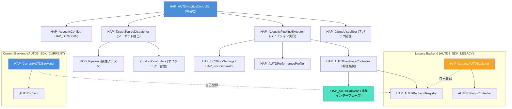

# AUTD3 SDK 新旧仕様比較・移行ドキュメント (v3.x/Legacy ➔ v0.9.0/Current) 仕様書

> 📂 **親ノード**: [Haptics.md](./Haptics.md) | 🏷️ **種類**: 🔧 SDK移行ガイド  
> [RealTimeOcclusion Wiki (ポータル)](./Wiki.md) に戻る

本ドキュメントでは、本システムでサポートしている AUTD3 SDK の**旧仕様 (Legacy SDK: AUTD3Sharp v3.x系)**と**新仕様 (Current SDK: autd3-sdk v0.9.0系)**における API、設計思想、アーキテクチャの違い、およびプロジェクトでの切り替え手順について解説します。

---

## 1. 概要

本プロジェクトは、旧 SDK 環境と新 SDK 環境の両方をいつでも実機で検証・動作させられるよう、**バックエンド分離アーキテクチャ**を採用しています。上位のコントローラーや焦点生成ロジックは一切の SDK 直接参照を持たず、抽象インターフェース `IHAP_AUTDBackend` を通じて操作されます。

### 主な特徴

* **バックエンド分離（プラグイン型自己登録）**: `Haptics.asmdef` は SDK 非依存であり、インストールされた SDK に応じて `Haptics.Backend.Legacy` または `Haptics.Backend.Current` が自動コンパイルされ、`HAP_AUTDBackendRegistry` に自己登録されます。
* **上位層からの `#if` 排除**: 焦点データは SDK 非依存の `HAP_FocusPoint` 構造体として生成・管理され、上位コードにコンパイルシンボル分岐を持ち込みません。
* **神クラス解消と責務分離**: `HAP_AUTDHapticsController` はライフサイクル司令塔に特化し、設定データ (`Config`)、ターゲット抽出 (`HAP_TargetSourceDispatcher`)、パイプライン実行 (`HAP_AcousticPipelineExecutor`)、Gizmo 描画 (`HAP_GizmoVisualizer`) に完全分離されています。
* **2段タブ式統合 Inspector**: `HAP_AUTDHapticsControllerEditor` 上で 6 つのタブ (`General`, `Hardware`, `Placement`, `Acoustics`, `HCD Foci`, `Debug`) を 2 段ツールバーで直感的に切り替え操作でき、個別コンポーネントの二重表示を防止しています。
* **ワンタップ自動切り替えスクリプト**: PowerShell スクリプト [switch-sdk.ps1](file:///c:/Users/hongo/Documents/tsutsumi/RealTimeOcclusion/switch-sdk.ps1) により、Package Manager 依存関係を一括で切り替えることができます。
* **非同期 Client 通信**: 新 SDK (v0.9.0) では完全な非同期 `async/await` 通信モデルを採用し、ネットワーク送信に伴うメインスレッドのブロッキングを排除しています。

---

## 2. 設計思想・アーキテクチャ

### 2.1 ディレクトリ構成

```text
Assets/Features/Haptics/Scripts/
├── Haptics.asmdef                             # SDK非依存の共通アセンブリ
├── Backends/                                  # SDKバックエンド実装
│   ├── Current/
│   │   ├── Haptics.Backend.Current.asmdef     # defineConstraints: AUTD3_SDK_CURRENT
│   │   └── HAP_CurrentAUTDBackend.cs          # autd3-sdk v0.9.0 実装
│   └── Legacy/
│       ├── Haptics.Backend.Legacy.asmdef      # defineConstraints: AUTD3_SDK_LEGACY
│       └── HAP_LegacyAUTDBackend.cs           # AUTD3Sharp v3.x 実装
├── Config/                                    # 責務分離された純粋データ設定クラス (Pure C#)
│   ├── HAP_AcousticConfig.cs                  # 音響・ホログラフィ・指向性設定
│   ├── HAP_ProfilingConfig.cs                 # プロファイラ・同期送信設定
│   └── HAP_STMConfig.cs                       # STM変調モード・周波数設定
├── Core/                                      # 共通コア・インターフェース・主コントローラー
│   ├── HAP_AUTDBackendRegistry.cs             # バックエンド自己登録レジストリ
│   ├── HAP_AUTDEnums.cs                       # 共通列挙型 (HoloAlgorithm, STMMode等)
│   ├── HAP_AUTDHapticsController.cs           # 触覚パイプライン統括司令塔 (Orchestrator)
│   ├── HAP_BaseObjectHapticsController.cs     # オブジェクト部位触覚基底
│   ├── HAP_FocusPoint.cs                      # 焦点値型 (Vector3 Position, float Pascal)
│   ├── HAP_HapticsSources.cs                  # 焦点生成データソースインターフェース
│   └── IHAP_AUTDBackend.cs                    # バックエンド抽象インターフェース
├── CustomControllers/                         # オブジェクト固有の触覚コントローラー
│   ├── HAP_FoxBodyHapticsController.cs
│   ├── HAP_FoxFootHapticsController.cs
│   └── HapticsIllusion/
├── Debug/                                     # デバッグ・可視化・Gizmo・統一ログ連携
│   ├── HAP_AUTDDebugDisabler.cs               # 特定デバイス強制ミュート
│   ├── HAP_GizmoVisualizer.cs                 # Gizmo デバッグ可視化
│   ├── HAP_LogTriggers.cs                     # AppLogManager サブトリガー登録
│   └── HCD_AutdControllerBridge.cs
├── Hardware/                                  # 物理デバイス通信・配置・TransformLoader
│   ├── AUTD3Device.cs                         # 単一アレイデバイス定義
│   ├── HAP_AUTDCalibration.cs                 # キャリブレーション機能
│   ├── HAP_AUTDDeviceGroup.cs                 # デバイスグループ構造
│   ├── HAP_AUTDHardwareController.cs          # ハードウェア接続・リンク・変調管理
│   └── HAP_AUTDTransformLoader.cs             # デバイス配置JSON保存/復元・生成
├── Processors/                                # アルゴリズム・データ変換・パイプライン実行者
│   ├── HAP_AcousticPipelineExecutor.cs        # 焦点生成〜バックエンド送信実行
│   ├── HAP_AUTDPerformanceProfiler.cs         # パイプライン処理時間計測
│   ├── HAP_DeviceGrouping.cs                  # デバイス幾何グルーピング計算
│   ├── HAP_FociGenerator.cs                   # 接触点からの焦点計算 (SDK非依存)
│   ├── HAP_HCDFociSettings.cs                 # HCD接触領域に対する焦点生成設定
│   ├── HAP_ObjectFociGenerator.cs             # オブジェクト部位焦点生成
│   └── HAP_TargetSourceDispatcher.cs          # ターゲットデータ抽出・排他制御
└── Editor/                                    # エディタ拡張
    ├── HAP_AUTDHapticsControllerEditor.cs     # 2段タブ親インスペクター
    ├── Drawers/                               # 6タブ専任Drawer & EditorContext
    ├── SubComponents/                         # 個別コンポーネント用スリムエディタ (二重展開抑止)
    │   ├── HAP_AUTDHardwareControllerEditor.cs
    │   ├── HAP_AUTDTransformLoaderEditor.cs
    │   └── HAP_HCDFociSettingsEditor.cs
    ├── Calibration/                           # キャリブレーション専用エディタ
    └── CustomControllers/                     # 各カスタムコントローラー専用エディタ
```

### 2.2 クラス相関図



### 2.3 処理フロー

1. **初期化時**: シーン起動前（`BeforeSceneLoad`）に、有効なバックエンドが `HAP_AUTDBackendRegistry.RegisterBackend()` を呼び出して自己登録します。
2. **接続確立時**: `HAP_AUTDHardwareController.Awake()` が `HAP_AUTDBackendRegistry.CreateBackend()` からインスタンスを生成し、`OpenAsync()` でデバイス群へ接続します。
3. **ターゲット抽出時**: `HAP_AUTDHapticsController.Update()` 内で `HAP_TargetSourceDispatcher.CollectTargets()` が呼び出され、選択されたモード（`AutoHCD`, `ObjectTarget`, `Manual`）に応じて有効な接触対象を収集します。
4. **焦点計算と送信時**: `HAP_AcousticPipelineExecutor.Execute()` が `HAP_HCDFociSettings` またはフォールバックジェネレーターを用いて焦点を生成し、`hardwareController.Backend.SendFoci()` を経由してデバイスへ送信します。ターゲットが存在しない場合は `StopOutput()` (Null送信) が安全に実行されます。
5. **デバッグ描画時**: `HAP_AUTDHapticsController.OnDrawGizmos()` が `HAP_GizmoVisualizer.DrawControllerGizmos()` に委譲され、デバイス配置や指向性グルーピングが Scene ビュー上に視覚化されます。

---

## 3. セットアップ・使用方法

### 3.1 SDK環境の自動切り替え手順 (`switch-sdk.ps1`)

ルートディレクトリスクリプト [switch-sdk.ps1](file:///c:/Users/hongo/Documents/tsutsumi/RealTimeOcclusion/switch-sdk.ps1) を使用した切り替え手順です。

#### Step 1: PowerShell 起動と引数指定

Unity エディタを閉じた状態で、PowerShell から以下のコマンドを実行します。

```powershell
# 新 SDK (v0.9.0) へ切り替える場合
.\switch-sdk.ps1 new

# 旧 SDK (v3.x / Legacy) へ切り替える場合
.\switch-sdk.ps1 legacy

# 現在の適用状況を確認する場合
.\switch-sdk.ps1
```

#### Step 2: 変更の確認と Unity 起動

スクリプト実行により、`Packages/manifest.json` のパッケージ参照が自動更新され、不要なプロジェクトキャッシュがクリーンアップされます。Unity を起動すると、asmdef の `versionDefines` に基づいて対応するバックエンドのみが自動でコンパイルされます。

---

## 4. 仕様・パラメータ詳細

### 4.1 新旧 API 仕様比較表

| 項目 | 旧仕様 (v3.x / Legacy SDK) | 新仕様 (v0.9.0 / Current SDK) |
|---|---|---|
| **パッケージ名** | `com.shinolab.autd3` | `com.shinolab.autd3-sdk` 系 |
| **名前空間** | `AUTD3Sharp` / `AUTD3Sharp.Gain.Holo` | `AUTD3` / `AUTD3.Holo` / `AUTD3.Link` |
| **接続管理** | `Controller.OpenWithOption(...)` | `await Client.OpenAsync(geometry, link, config)` |
| **送信 API** | `controller.Send(datagram)` (同期ブロッキング) | `await client.SendCheckedAsync(frame)` (非同期) |
| **焦点型** | `(Point3, Amplitude)` | `AmplitudeTarget(Vector3, Amplitude)` |
| **ホログラフィ生成** | `new GSPAT(activeFoci, option)` | `Holo.Gspat(geometry, foci, wavelength, option, buffer)` |
| **GSPAT 反復回数** | 固定 (100回) | `gspatRepeatCount` で可変制御可能（**デフォルト 20回** に最適化、CPU負荷を 1/5 に削減） |
| **単焦点 STM** | `new FociSTM(mergedFrames, freq)` | `new FociStm(Nearest(freq), controlPointsList)` |
| **多焦点 STM** | `new GainSTM(gains, freq)` | `new PatternStm(Nearest(freq), patternBuffers)` |
| **TwinCAT Link** | `new AUTD3Sharp.Link.TwinCAT()` | `TwinCATLinkOption.Local()` |
| **Simulator Link** | `new AUTD3Sharp.Link.Remote(ipEndPoint, option)` | `new RemoteLinkOption("127.0.0.1:8080")` |

---

## 5. デバッグ・留意事項

### 5.1 トラブルシューティング

* **実機ファームウェアのバージョン不一致**: 新 SDK (0.9.0) 用にファームウェアを更新した場合、旧 SDK (Legacy) からのアクセス時に通信拒否や警告が発生する場合があります。実機での運用時は、ファームウェアバージョンと選択 SDK が一致していることを確認してください。
* **バックエンド未登録警告**: Unity コンソールに `No AUTD backend registered` が出力される場合は、Package Manager で `com.shinolab.autd3` または `com.shinolab.autd3-sdk` のいずれかが正しくインポートされているか確認してください。
* **Inspector の設定二重表示**: 同一 GameObject に `HAP_AUTDHardwareController` や `HAP_AUTDTransformLoader` がアタッチされていても、専用のスリムエディタが自動適用されるため、設定が重複展開されることはありません。設定はすべて `HAP_AUTDHapticsController` の該当タブから操作します。

### 5.2 統制ログシステム (`AppLogManager`) との同期

動作ログには `[Haptics]` プレフィックスが付与されます。詳細については [Logging.md](./Logging.md) を参照してください。

| タグ名 | 対象コンポーネント / 役割 |
|---|---|
| `TagBackend` | デバイス接続・切断・バックエンド初期化・非同期送信ログ |
| `TagHardware` | 変調（Modulation）・サイレンサー・ファン設定の適用ログ |
| `TagTransformLoader` | デバイス配置 JSON 保存・読み込み・プレハブ生成ログ |
| `TagPerformanceProfiler` | パイプライン処理時間計測・スレッド同期ログ |
| `TagCalibration` | キャリブレーション信号照射・オフセット調整ログ |
