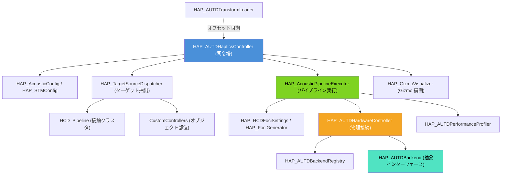

# 触覚フィードバック統合システム (Haptics System) 仕様書

> 📂 **親ノード**: [Wiki.md](./Wiki.md) | 🏷️ **種類**: 🏗️ システム設計書  
> [RealTimeOcclusion Wiki (ポータル)](./Wiki.md) に戻る  
> 📎 **関連ドキュメント**: [AUTD3_SDK_Transition.md](./AUTD3_SDK_Transition.md) | [HowToUseHaptics.md](./HowToUseHaptics.md) | [HapticsAlgorithmComparison.md](./HapticsAlgorithmComparison.md)

本ドキュメントでは、空中超音波フェーズドアレイ (AUTD3) を用いてリアルタイムに触覚刺激（力覚・触覚フィードバック）を提示する「触覚フィードバック統合システム (`HAP`: Haptics System)」の設計思想、モジュール構成、使用手順、パラメータ詳細およびデバッグ方法について解説します。

---

## 1. 概要

本システムは、`HCD_Pipeline` (接触判定システム) によって検出された 3D 接触点群・クラスタ情報、または仮想オブジェクト部位の接触判定を受け取り、AUTD3 超音波アレイを制御して空中焦点 (Focus Point) または時空間変調パターン (STM: Spatio-Temporal Modulation) をリアルタイムに提示する基盤です。

### 主な特徴

* **マルチアレイデバイス統括**: 複数の AUTD3 フェーズドアレイの空間配置（トランスフォーム）を一括管理し、位相・振幅パターンを最適計算します。
* **プラグイン型バックエンド分離**: AUTD3 SDK v3.x (Legacy) および v0.9.0 (Current) の両方に対応し、`switch-sdk.ps1` によりシームレスに切り替え動作が可能です。
* **責務分離と神クラス解消**: 主コントローラー [`HAP_AUTDHapticsController`](file:///c:/Users/hongo/Documents/tsutsumi/RealTimeOcclusion/Assets/Features/Haptics/Scripts/Core/HAP_AUTDHapticsController.cs) はライフサイクル統括に特化し、設定データ ([`HAP_AcousticConfig`](file:///c:/Users/hongo/Documents/tsutsumi/RealTimeOcclusion/Assets/Features/Haptics/Scripts/Config/HAP_AcousticConfig.cs) 等)、ターゲット抽出 ([`HAP_TargetSourceDispatcher`](file:///c:/Users/hongo/Documents/tsutsumi/RealTimeOcclusion/Assets/Features/Haptics/Scripts/Processors/HAP_TargetSourceDispatcher.cs))、パイプライン実行 ([`HAP_AcousticPipelineExecutor`](file:///c:/Users/hongo/Documents/tsutsumi/RealTimeOcclusion/Assets/Features/Haptics/Scripts/Processors/HAP_AcousticPipelineExecutor.cs)) に完全分離されています。
* **2段タブ式統合 Inspector**: 1画面から通信設定、配置管理、音響、STM、焦点設定、プロファイリングを統合管理できます。また、個別コンポーネント用スリムエディタにより、インスペクター上での設定の二重展開を防止しています。
* **指向性グルーピング照射**: 接触面の法線ベクトルとデバイスの向きを比較し、最適なデバイスからのみ超音波を照射する高効率照射機能を備えています。

---

## 2. 設計思想・アーキテクチャ

### 2.1 生成ファイル・ディレクトリ構成

```text
Assets/Features/Haptics/Scripts/
├── Haptics.asmdef                             # SDK非依存の共通アセンブリ
├── Backends/                                  # 新旧SDKバックエンド実装
│   ├── Current/                               # autd3-sdk v0.9.0 実装
│   └── Legacy/                                # AUTD3Sharp v3.x 実装
├── Config/                                    # Pure C# 設定クラス
│   ├── HAP_AcousticConfig.cs                  # 音響・ホログラフィ設定
│   ├── HAP_STMConfig.cs                       # STM変調設定
│   └── HAP_ProfilingConfig.cs                 # 処理時間計測設定
├── Core/                                      # 共通コア・インターフェース
│   ├── HAP_AUTDBackendRegistry.cs             # バックエンド登録レジストリ
│   ├── HAP_AUTDEnums.cs                       # 共通列挙型定義
│   ├── HAP_AUTDHapticsController.cs           # 触覚パイプライン統括司令塔
│   ├── HAP_BaseObjectHapticsController.cs     # オブジェクト部位触覚基底 (神クラス解消済み)
│   ├── HAP_FocusPoint.cs                      # 焦点構造体
│   └── IHAP_AUTDBackend.cs                    # バックエンド抽象インターフェース
├── CustomControllers/                         # 個別オブジェクト用触覚コントローラー
│   ├── HAP_FoxBodyHapticsController.cs        # 狐全身8部位の触覚ターゲット管理
│   ├── HAP_FoxFootHapticsController.cs        # 狐4足・尻尾の足部触覚管理
│   └── HapticsIllusion/                       # 触覚錯覚カスタムコントローラー群
├── Debug/                                     # デバッグ・Gizmo・統一ログ
│   ├── HAP_AUTDDebugDisabler.cs               # 特定デバイス強制停止
│   ├── HAP_GizmoVisualizer.cs                 # 焦点・アレイ範囲可視化
│   ├── HAP_ObjectGizmoDrawer.cs               # オブジェクト部位 Gizmo 描画ヘルパー
│   ├── HAP_ObjectHapticsDiagnostics.cs        # オブジェクト触覚診断レポート生成
│   └── HAP_LogTriggers.cs                     # AppLogManager 登録＆定期ログ
├── Hardware/                                  # 物理デバイス通信・配置
│   ├── AUTD3Device.cs                         # 単一アレイデバイス定義
│   ├── HAP_AUTDHardwareController.cs          # 物理通信・リンク管理
│   └── HAP_AUTDTransformLoader.cs             # デバイス配置JSON保存/復元
├── Processors/                                # アルゴリズム・パイプライン実行者
│   ├── HAP_AcousticPipelineExecutor.cs        # 焦点生成〜バックエンド送信実行
│   ├── HAP_AUTDPerformanceProfiler.cs         # パフォーマンス計測
│   ├── HAP_DeviceGrouping.cs                  # デバイス幾何グルーピング
│   ├── HAP_FociGenerator.cs                   # 接触点焦点生成
│   ├── HAP_HCDFociSettings.cs                 # HCD焦点生成パラメータ設定
│   ├── HAP_ObjectFociGenerator.cs             # オブジェクト部位焦点組み立て
│   ├── HAP_TargetContactEvaluator.cs          # 接地・手近接判定評価 (Pure C#)
│   └── HAP_TargetSourceDispatcher.cs          # ターゲットデータ抽出
└── Editor/                                    # エディタ拡張
    ├── HAP_AUTDHapticsControllerEditor.cs     # 2段タブ親インスペクター
    ├── Drawers/                               # タブ専任 Drawer 群
    ├── SubComponents/                         # 個別コンポーネント用スリムエディタ
    ├── Calibration/                           # キャリブレーション用エディタ
    └── CustomControllers/                     # カスタムコントローラー用エディタ
```

### 2.2 クラス相関図



### 2.3 処理フロー

```text
[HCD_Pipeline / CustomController] (接触クラスタ & オブジェクト部位ターゲット)
       │
       ▼
[HAP_TargetSourceDispatcher] (モード判定 & アクティブターゲット抽出)
       │
       ▼
[HAP_AcousticPipelineExecutor] (焦点位置・強度計算 & GSPAT/Naive ホログラフィ構築)
       │
       ▼
[HAP_AUTDHardwareController.Backend] (IHAP_AUTDBackend 経由の非同期/同期送信)
       │
       ▼
[AUTD3 超音波アレイ実機 / Simulator]
```

---

## 3. セットアップ・使用方法

### 3.1 クイックスタート手順

#### Step 1: シーンオブジェクトの配置

1. シーン内の管理オブジェクト（例: `GenaralAUTD3Controller`）に [`HAP_AUTDHapticsController`](file:///c:/Users/hongo/Documents/tsutsumi/RealTimeOcclusion/Assets/Features/Haptics/Scripts/Core/HAP_AUTDHapticsController.cs) をアタッチします。
2. 依存コンポーネント（[`HAP_AUTDHardwareController`](file:///c:/Users/hongo/Documents/tsutsumi/RealTimeOcclusion/Assets/Features/Haptics/Scripts/Hardware/HAP_AUTDHardwareController.cs), [`HAP_AUTDTransformLoader`](file:///c:/Users/hongo/Documents/tsutsumi/RealTimeOcclusion/Assets/Features/Haptics/Scripts/Hardware/HAP_AUTDTransformLoader.cs)）は `Awake()` 時に自動検出されます。同一オブジェクトにアタッチされていても、専用のスリムエディタによりインスペクターは自動的にスッキリ整理されます。

#### Step 2: 2段タブ式 Inspector でのパラメータ設定

`HAP_AUTDHapticsController` の Inspector 上部にある 2 段ツールバーから各タブを切り替えて設定を行います：

```
[ ⚙️ General ]   [ 📡 Hardware ]   [ 📐 Placement ]
[ 🔊 Acoustics ] [ 🎯 HCD Foci ]   [ ⏱️ Debug ]
```

* **⚙️ General**: 動作モード (`AutoHCD`: 手指接触クラスタ連動 / `ObjectTarget`: 仮想オブジェクト部位 / `Manual`: 手動API) を選択します。
* **📡 Hardware**: 通信リンク種別 (`SOEM`, `TwinCAT`, `Simulator`)、変調周波数、サイレンサーを設定します。
* **📐 Placement**: デバイス配置 JSON の保存/復元、プレハブ自動生成、全体焦点オフセットを調整します。
* **🔊 Acoustics**: ホログラフィアルゴリズム (`GSPAT`, `Naive`)、照射強度 (`focusIntensityPascal`: デフォルト 10,000 Pa)、GSPAT 反復回数、指向性グルーピングを設定します。
* **🎯 HCD Foci**: 手指接触領域に対する焦点生成方式 (`Simplified`, `Precision`) を設定します。
* **⏱️ Debug**: 処理時間プロファイラーの有効化、Scene ビューの Gizmo 表示、特定デバイスの強制ミュートを制御します。

#### Step 3: 実行

Play モードに入ると、選択されたバックエンド経由で AUTD3 への通信が確立され、接触検出時に即座に超音波焦点が出力されます。

---

## 4. 仕様・パラメータ詳細

### 4.1 主要パラメータ一覧

| パラメータ名 | 所属設定クラス | 既定値 | 説明 |
|---|---|---|---|
| `sourceMode` | コントローラー本体 | `AutoHCD` | 触覚ターゲットのデータソース (`AutoHCD`, `ObjectTarget`, `Manual`) |
| `focusIntensityPascal` | `HAP_AcousticConfig` | `10000.0f` | 超音波照射強度 (Pascal)。最大約 10,000 Pa |
| `holoAlgorithm` | `HAP_AcousticConfig` | `GSPAT` | ホログラフィ計算アルゴリズム (`GSPAT`, `Naive`) |
| `gspatRepeatCount` | `HAP_AcousticConfig` | `20` | GSPAT 反復回数 (1〜100)。20 回で高品質かつ低負荷を実現 |
| `enableDirectionalGrouping` | `HAP_AcousticConfig` | `false` | 面の法線とデバイスの向きを比較した最適照射の有効化 |
| `stmMode` | `HAP_STMConfig` | `FociSTM` | 時空間変調モード (`FociSTM`: 単焦点, `GainSTM`: 多焦点) |
| `stmFrequency` | `HAP_STMConfig` | `150.0f` | STM 再生周波数 (Hz) |
| `enableProfiling` | `HAP_ProfilingConfig` | `false` | パイプライン処理時間の計測有効化 |
| `synchronousSend` | `HAP_ProfilingConfig` | `false` | メインスレッドでの完全同期送信フラグ |

---

## 5. デバッグ・留意事項

### 5.1 トラブルシューティング

* **超音波が出力されない場合**:
  1. `HAP_AUTDHapticsController` Inspector 上部の PlayMode ステータスバナーで `● Hardware Connected` と表示されているか確認してください。
  2. `bypassHaptics` が `false` であることを確認してください。
  3. `sourceMode` が `AutoHCD` の場合、`HCD_Pipeline` で手指の接触クラスタが正常に検出されているか確認してください。
* **Inspector の設定二重表示が発生しない理由**:
  `HAP_AUTDHardwareControllerEditor` 等のスリムエディタが個別コンポーネントの Default Inspector 展開を抑制し、`HAP_AUTDHapticsController` のタブ UI に一本化しているためです。

### 5.2 統制ログシステム (`AppLogManager`) との同期

動作ログには `[Haptics]` プレフィックスが付与されます。詳細については [Logging.md](./Logging.md) を参照してください。

| タグ名 | 対象コンポーネント / 役割 |
|---|---|
| `TagBackend` | デバイス接続・切断・バックエンド初期化・非同期送信ログ |
| `TagHardware` | 変調（Modulation）・サイレンサー・ファン設定の適用ログ |
| `TagTransformLoader` | デバイス配置 JSON 保存・読み込み・プレハブ生成ログ |
| `TagPerformanceProfiler` | パイプライン処理時間計測・スレッド同期ログ |
| `TagCalibration` | キャリブレーション信号照射・オフセット調整ログ |
