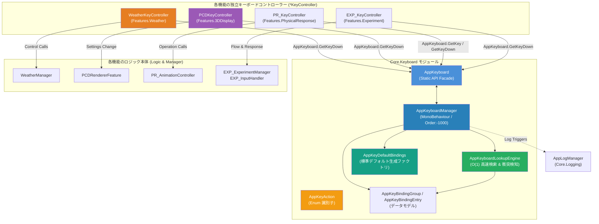

# 統制キーボード管理システム (AppKeyboardManager & AppKeyboard) 仕様書

> 📂 **親ノード**: [Wiki.md](./Wiki.md) | 🏷️ **種類**: 🏗️ システム設計書  
> [RealTimeOcclusion Wiki (ポータル)](./Wiki.md) に戻る

本ドキュメントでは、アプリケーション全体のキーボード入力を一元管理し、モジュール間のキー重複（競合）を防止・検知しつつ、コード側の Inspector を汚さずに統一操作を可能にする**統制キーボード管理システム (`AppKeyboardManager` & `AppKeyboard`)** の仕様および実装・利用手順について解説します。

---

## 1. 概要

本プロジェクトでは、点群オクルージョン表示（`PCD`）、天候シミュレーション（`Weather`）、物理インタラクション・アニメーション（`PhysicalResponse`）、心理物理実験（`Experiment`）など、多数の機能モジュールが同時に動作します。

従来は各モジュールが独立して `KeyCode` をシリアライズしたり直接ハードコードしていたため、**同一キーの衝突**（例: 天候の雲トグル `KeyCode.C` と点群カラーモード切替 `KeyCode.C` の重複）や、全体でどのキーが使用されているかを把握できない問題が発生していました。

本システムは、[`AppLogManager`](./Logging.md) の設計思想を踏襲し、以下の価値を提供します。

* **中央集中キーバインド管理**: 全モジュールのキー設定を `AppKeyboardManager` インスペクター上で一覧表示・編集・グループ別ON/OFF制御。
* **重複（競合）の自動検知と警告ハイライト**: 同一キーが複数アクションに割り当てられた場合、インスペクター上で警告および衝突ペアを即座に明示。
* **シンプルかつ型安全な直接呼び出し（パターン A）**: 各クラスは個別キー変数を保持せず、`AppKeyboard.GetKeyDown(AppKeyAction.Weather_ToggleRain)` のように 1 行で安全に判定可能。
* **ゼロアロケーション（GC ゼロ）**: 毎フレームの `Update` 内でのキー判定において GC Alloc を一切発生させない `O(1)` ルックアップエンジンを採用。
* **早期初期化保証 (`DefaultExecutionOrder(-1000)`)**: 他のコンポーネントの `Awake` や `Update` よりも先に確実に初期化・キャッシュ構築。
* **自動フォールバック対応**: テスト用シーンなどでマネージャーが存在しない場合でも、デフォルトキー設定を用いて例外なく動作を継続。

---

## 2. 設計思想・アーキテクチャ

### 2.1 ディレクトリ構成

```text
Assets/
├── Core/Scripts/Keyboard/
│   ├── AppKeyAction.cs               # 全アクション識別子 Enum (型安全定義)
│   ├── AppKeyBindingGroup.cs          # カテゴリグループ・個別バインド・衝突情報モデル (Serializable)
│   ├── AppKeyDefaultBindings.cs       # 標準キーバインド構成定義 (衝突解消済み初期値)
│   ├── AppKeyboardLookupEngine.cs     # 高速 O(1) ルックアップ・衝突検知 Pure C# エンジン
│   ├── AppKeyboardManager.cs          # [Order:-1000] 一元管理 MonoBehaviour マネージャー
│   └── AppKeyboard.cs                 # 静的 API ファサード (GetKeyDown / GetKey / GetKeyUp 等)
├── Editor/
│   └── AppKeyboardManagerEditor.cs    # 重複警告・カテゴリ別 Foldout を備えた Inspector 拡張
└── Features/ (各機能モジュール)
    ├── 3DDisplay/Scripts/Occlusion/Controllers/
    │   └── PCDKeyController.cs        # PCD専用キーボードコントローラー
    ├── PhysicalResponse/Scripts/Core/
    │   ├── PR_KeyController.cs        # PR専用キーボードコントローラー (アニメ/移動/撮影)
    │   ├── PR_AnimationController.cs  # PRアニメーション・モデル制御ロジック本体
    │   └── PR_PCDKeyController.cs      # 後方互換性ラッパー (PCDKeyController継承)
    ├── Weather/Scripts/Core/
    │   └── WeatherKeyController.cs    # 天候専用キーボードコントローラー
    └── Experiment/Scripts/Core/
        └── EXP_KeyController.cs       # 実験専用キーボードコントローラー (開始/中断/回答)
```

### 2.2 クラス相関図



### 2.3 処理フロー

1. **初期化時 (`Awake` / `OnEnable`)**:
   - `AppKeyboardManager` が `DefaultExecutionOrder(-1000)` により最優先起動。
   - `AppKeyBindingGroup` リストを走査し、`AppKeyboardLookupEngine.BuildLookup()` により `Dictionary<AppKeyAction, RuntimeBindingInfo>` を構築。
   - 同時にキー重複（同一 `KeyCode` が複数アクションに割り当てられている状態）をスキャンしキャッシュ。
2. **実行時 (`Update` hot path)**:
   - 各モジュール（`WeatherKeyController`, `PR_PCDKeyController` 等）から `AppKeyboard.GetKeyDown(action)` が呼び出される。
   - `_actionLookup` 辞書から `O(1)` でエントリーを取得。
   - 全体有効 (`globalEnableInput`)、グループ有効 (`isCategoryEnabled`)、個別有効 (`isEnabled`) の全条件が満たされている場合のみ、`Input.GetKeyDown(primaryKey)` または `Input.GetKeyDown(secondaryKey)` を評価して返却。

---

## 3. セットアップ・使用方法

### Step 1: シーンへの配置

1. シーン内のルート GameObject（通常は `_AppRoot` や `_Managers`）に `AppKeyboardManager` コンポーネントをアタッチします。
2. インスペクターを開くと、自動的に全機能の標準キー配置（Weather, PCD, PhysicalResponse, Experiment, System）が生成されます。
3. もし手動でリセットしたい場合は、**「🔄 Reset to Default Bindings」** ボタンを押下します。

### Step 2: 機能コンポーネントでの利用 (パターン A)

各コンポーネントでは、個別 `KeyCode` フィールドを定義せず、`AppKeyboard` を直接呼び出します。

```csharp
using UnityEngine;
using Core.Keyboard;
using Core.Logging;

public class MyFeatureController : MonoBehaviour
{
    private void Update()
    {
        // アクションの押下瞬間を判定
        if (AppKeyboard.GetKeyDown(AppKeyAction.Weather_ToggleRain))
        {
            ToggleRain();
            AppLogger.Log(this, "雨トグルが実行されました");
        }

        // 押し続けを判定 (移動など)
        if (AppKeyboard.GetKey(AppKeyAction.PR_MoveForward))
        {
            MoveForward();
        }
    }
}
```

### Step 3: キーの変更と重複の確認

1. `AppKeyboardManager` の Inspector 上で、変更したいアクションの `Primary Key` や `Secondary Key` をドロップダウンから選択します。
2. 重複しているキーが存在する場合、上部に **「⚠️ キーの重複（衝突）が検出されました」** という警告ボックスが表示され、該当するキー入力欄が赤色でハイライトされます。

---

## 4. 仕様・パラメータ詳細

### 4.1 主要キーアクション一覧 (`AppKeyAction`)

| モジュール | アクション名 (`AppKeyAction`) | デフォルト主キー | デフォルト副キー | 説明 |
| :--- | :--- | :--- | :--- | :--- |
| **Weather** | `Weather_ToggleRain` | `G` | `None` | 雨パーティクル ON/OFF トグル |
| | `Weather_ToggleCloud` | **`V`** | `None` | 雲レイヤー ON/OFF (PCDのCキー衝突回避) |
| | `Weather_Strike` | `B` | `None` | 落雷・フラッシュエフェクト発生 |
| | `Weather_RainPreset0` | `Alpha7` | `None` | 雨強度 0% (晴れ) |
| | `Weather_RainPreset30` | `Alpha8` | `None` | 雨強度 30% (小雨) |
| | `Weather_RainPreset70` | `Alpha9` | `None` | 雨強度 70% (強い雨) |
| | `Weather_RainPreset100`| `Alpha0` | `None` | 雨強度 100% (豪雨・嵐) |
| **PCD** | `PCD_ToggleMethod` | `M` | `None` | 提案手法 / 従来手法の全ON/OFF一括切替 |
| | `PCD_ToggleTagOptimization` | `Alpha1` | `None` | ① タグスキップ最適化 ON/OFF |
| | `PCD_ToggleDensity` | `Alpha2` | `None` | ② 密度計算補正 ON/OFF |
| | `PCD_ToggleSoftFade` | `Alpha3` | `None` | ③ ソフトフェード ON/OFF |
| | `PCD_CycleHoleFilling` | `Alpha4` | `None` | ④ 穴埋め手法 (Hole Filling) サイクル |
| | `PCD_ToggleFadeWidth` | `T` | `None` | マスク境界幅 0.0 ↔ 0.2 切替 |
| | `PCD_ToggleOcclusionMap` | `O` | `None` | オクルージョンマップ表示トグル |
| | `PCD_TogglePixelTagMap` | `P` | `None` | ピクセルタグマップ表示トグル |
| | `PCD_CycleKernelType` | `L` | `None` | カーネル形状サイクル |
| | `PCD_CycleEvaluationMode` | `K` | `None` | 評価モードサイクル |
| | `PCD_CycleMinSectors` | `J` | `None` | 最小オクルージョンセクター数サイクル |
| | `PCD_CycleColorMode` | **`C`** | `None` | 点群カラーモード順次切替 |
| **PhysicalResponse** | `PR_ResetAnimation` | `Escape` | `None` | アニメーション・位置リセット |
| | `PR_ToggleRunWalk` | `Return` | `KeypadEnter` | 走る/歩く トグル |
| | `PR_SwitchTarget` | `Tab` | `None` | 操作対象オブジェクト切替 |
| | `PR_ToggleAutoMove` | `Space` | `None` | 自動周回モード ON/OFF |
| | `PR_MoveForward` | `W` | `UpArrow` | 手動移動: 前進 |
| | `PR_MoveBack` | `S` | `DownArrow` | 手動移動: 後退 |
| | `PR_MoveLeft` | `A` | `LeftArrow` | 手動移動: 左 |
| | `PR_MoveRight` | `D` | `RightArrow`| 手動移動: 右 |
| | `PR_MoveUp` | `E` | `None` | 手動移動: 上昇 |
| | `PR_MoveDown` | `Q` | `None` | 手動移動: 下降 |
| | `PR_ToggleLookAt` | `F` | `None` | 視線追従トグル |
| **Experiment** | `EXP_Start` | `Space` | `None` | 実験開始 |
| | `EXP_Abort` | `Escape` | `None` | 実験中断 |
| | `EXP_ToggleControlPanel` | `F1` | `None` | コントロールパネル表示切替 |
| | `EXP_Choice1` | `Z` | `Alpha1` | 選択肢 1 (Yes) |
| | `EXP_Choice2` | `X` | `Alpha2` | 選択肢 2 (No) |
| | `EXP_AdjustUp` | `W` | `UpArrow` | 調整値 Up |
| | `EXP_AdjustDown` | `S` | `DownArrow`| 調整値 Down |
| | `EXP_Confirm` | `Return` | `None` | 回答決定 |
| | `EXP_Next` | `N` | `None` | 次の試行へ |
| **System** | `System_ToggleRecording` | `R` | `None` | 録画開始/停止 |

---

## 5. デバッグ・留意事項

### 5.1 重複（競合）発生時の挙動

同一キーが複数のアクティブなグループ・アクションに登録されている場合、Unity の `Input.GetKeyDown` は両方の判定を真として受け取ります。
意図しない同時発火を防ぐため、以下のいずれかを実施してください：
1. `AppKeyboardManager` の Inspector 上で警告を確認し、いずれかのアクションのキーを空いているキーに変更する。
2. 使用していない機能グループの `Group Enabled` チェックボックスを OFF にする（OFF のグループはキー判定が無効化されます）。

### 5.2 統制ログ管理 (`AppLogManager`) との連携

`AppKeyboardManager` は `[AppLoggable("Keyboard")]` 属性および `IAppLoggable` インターフェースを実装しており、[`AppLogManager`](./Logging.md) 上でログ出力トリガーを集中制御できます。

| サブトリガー | 説明 | デフォルト |
| :--- | :--- | :--- |
| `[AppKeyboard] Key Action Triggers` | キーアクション検出時のデバッグログ | 有効 (`true`) |

### 5.3 関連ドキュメント相互参照

* 統制ログ管理システム: [Logging.md](./Logging.md)
* 天候エフェクト仕様: [WeatherEffect.md](./WeatherEffect.md)
* オクルージョン描画仕様: [OcclusionRendering.md](./OcclusionRendering.md)
* 物理インタラクション仕様: [PhysicalResponse.md](./PhysicalResponse.md)
* 心理物理評価実験仕様: [Experiments.md](./Experiments.md)
