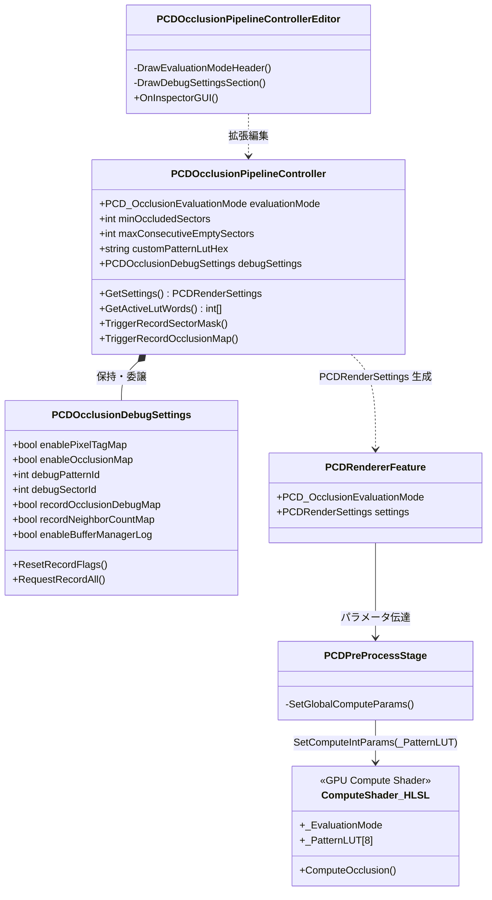
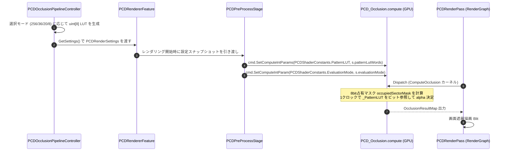

# 視覚オクルージョン・レンダリングシステム 仕様書

> 📂 **親ノード**: [Wiki.md](./Wiki.md) | 🏷️ **種類**: 🏗️ システム設計書  
> [RealTimeOcclusion Wiki (ポータル)](./Wiki.md) に戻る

本ドキュメントは、Intel RealSense 等のセンサーから取得したリアルタイム点群（Point Cloud）を URP RenderGraph パイプライン上でスクリーン空間に精密に投影し、Unity の仮想オブジェクトとの前後遮蔽（オクルージョン）を計算・描画する「視覚オクルージョン・レンダリングシステム」の設計思想、各モジュールの役割、評価モード（Mode 8, 20, 36, 256）、関数構成、および GPU Compute Shader における各種アルゴリズムの詳細を網羅したテクニカルリファレンスです。

---

## 1. 概要

本システムは、実環境からリアルタイムに取得した点群をスクリーン空間に投影し、Unity の仮想 3D 空間に配置されたオブジェクトとの前後関係（オクルージョン）をリアルタイムに計算・遮蔽描画する仕組みです。  
8 セクター方向占有マスクに基づくオクルージョン判定器（Mode 8 / 20 / 36 / 256）を搭載し、**デフォルトで完全最適化済み 256 パターン LUT（平均 IoU 96.02%）による 1 クロック高速テーブル参照** を実現しています。

```text
[統合点群バッファ (_globalBuffer) / 静的メッシュバッファ]
        │ 
        │ (RecordRenderGraph でノンブロッキングにバッファと頂点数を引き渡し)
        ▼
   [PCDRenderPass (URP RenderGraph)]
        │ 
        │ (多段 Compute Shader カーネルディスパッチ & _PatternLUT[8] バインド)
        ▼
[PCD_Occlusion.compute]
        │ (Mode 8 / 20 / 36 / 256 による 1 クロック判定 + Joint Bilateral / Pull-Push 補間)
        ▼
  [オクルージョンマップ出力 (画面遮蔽描画)]
```

### 主な特徴

* **4 段階の評価モードと最高精度 Mode 256 (Default)**:
  幾何学的占有パターンに基づく判定方式（Mode 8: 占有数判定、Mode 20: 連続非占有規則、Mode 36: 36 クラス回転不変 LUT、Mode 256: 256 パターン独立最適 LUT）を実装し、実測データで最高性能を達成した **Mode 256 (平均 IoU 96.02%)** を標準採用しています。
* **1 クロック GPU テーブル参照**:
  256 パターン（256 bit = 32 byte）の判定テーブルを 8 個の `uint`（`_PatternLUT[8]`）として Compute Shader に転送し、ビット演算（シフトと AND）のみの極小負荷でピクセルごとの可視・遮蔽を判定します。
* **責務分離されたデバッグ設計 (`PCDOcclusionDebugSettings`)**:
  インスペクタの肥大化を防ぐため、画面表示デバッグやキャプチャ用パラメータを `PCDOcclusionDebugSettings` に独立させ、エディタ上では折りたたみ（Foldout: 初期値閉じ）で管理します。
* **ゼロコピー高効率 GPU パイプライン**:
  CPU-GPU 間のデータ転送オーバーヘッドを排除し、深度情報から頂点バッファへの変換、姿勢変換、およびオクルージョン投影計算までを GPU Compute Buffer 上で一貫処理します。
* **RenderGraph 完全統合**:
  Unity 6 URP RenderGraph アーキテクチャに準拠し、描画パイプラインの途中に非同期オクルージョン計算パスを安全に挿入します。
* **堅牢な Hole Filling アルゴリズム**:
  エッジ保存型 Joint Bilateral フィルタ、およびマルチスケール解像度伝播を行う Pull-Push 法、Opening-Closing モルフォロジー補間を GPU Compute Shader 上に完全実装しています。

---

## 2. 設計思想・アーキテクチャ

### 2.1 ディレクトリ構成

```text
Assets/Features/3DDisplay/
├── ComputeShaders/
│   ├── PCD_Occlusion_Data.hlsl              # 共通定数・バッファ宣言 (_PatternLUT[8] 含む)
│   ├── PCD_Occlusion_Kernels_Core.hlsl      # 投影・密度計算カーネル
│   ├── PCD_Occlusion_Kernels_Occlusion.hlsl # オクルージョン判定 (Mode 8/20/36/256)
│   └── PCD_Occlusion_Kernels_Post.hlsl      # デバッグマップ描画・Blit カーネル
├── Materials/                               # オクルージョン遮蔽合成用マテリアル
├── Shaders/
│   └── PCD_Occlusion.compute                # 統合コンピュートシェーダ
└── Scripts/Occlusion/
    ├── Controllers/
    │   ├── PCDOcclusionPipelineController.cs # パイプライン統括コントローラー
    │   ├── PCDOcclusionDebugSettings.cs      # デバッグ・キャプチャ変数調整クラス (責務分離)
    │   └── PCDSettingsBridge.cs              # 設定ブリッジ・フォールバック
    ├── Editor/
    │   └── PCDOcclusionPipelineControllerEditor.cs # カスタムエディタ (Mode切替 & Foldout)
    ├── Passes/
    │   ├── PCDRendererFeature.cs             # URP ScriptableRendererFeature & 設定構造体
    │   └── PCDRenderPass.cs                  # URP RenderGraph パス統括
    ├── Resources/
    │   └── PCDShaderConstants.cs             # Shader プロパティ ID 一元定義
    └── Stages/
        ├── PCDPreProcessStage.cs             # パラメータ設定・前処理ステージ
        └── PCDPostProcessStage.cs            # 後処理・デバッグ出力ステージ
```

### 2.2 クラス相関図



### 2.3 処理フロー



---

## 3. セットアップ・使用方法

### 3.1 クイックスタート手順

#### Step 1: URP レンダラーアセット設定

1. Universal Render Pipeline (URP) の Universal Renderer Data アセットを開きます。
2. `Add Renderer Feature` から `PCDRendererFeature` を追加します。

#### Step 2: シーンコントローラー配置とモード選択

1. シーン内の管理用 GameObject に `PCDOcclusionPipelineController` をアタッチします。
2. Inspector 最上部の **「Occlusion Evaluation Mode」** ヘッダーから目的のモード（標準は **Mode 256 ★**）を選択します。

```text
▼ Occlusion Evaluation Mode
   [ Mode 8 (Occ < 7) ]  [ Mode 20 (R=4, L=1) ]  [ Mode 36 (36-LUT) ]  [ Mode 256 ★ (Opt-LUT) ]
```

#### Step 3: パラメータ表

| 設定項目 | 型 | 既定値 | 説明 |
|---|---|---|---|
| `evaluationMode` | `PCD_OcclusionEvaluationMode` | `PatternLUT256` | オクルージョン評価モード（`PatternLUT256`, `RotationLUT36`, `SectorConsecutiveZeros`, `SectorThreshold`, `Average`） |
| `minOccludedSectors` | `int` | `7` | 【Mode 8 / 20 用】最低占有セクター数 $R_{\mathrm{th}}$（Mode 8 最適値: 7, Mode 20 最適値: 4） |
| `maxConsecutiveEmptySectors` | `int` | `1` | 【Mode 20 用】許容最大連続非占有セクター数 $L_{\mathrm{th}}$（Mode 20 最適値: 1） |
| `customPatternLutHex` | `string` | `""` | 【Mode 36 / 256 用】カスタム 64 文字 HEX 文字列（空欄時は最適解を自動適用） |
| `minSearchLevel` | `int` | `6` | 近傍探索の最小ピラミッドレベル（0〜6） |
| `enableDensityBasedLOD` | `bool` | `true` | 点群密度に応じた動的 LOD 探索の有効化 |
| `enableGradientCorrection` | `bool` | `true` | 深度急変エッジでのオクルージョン・リーク防止補正 |
| `occlusionThreshold` | `float` | `0.8f` | オクルージョン判定の感度閾値 |
| `occlusionFadeWidth` | `float` | `0.1f` | 境界ソフトフェードの減衰幅 |
| `debugSettings` | `PCDOcclusionDebugSettings` | (集約) | デバッグ・キャプチャ用パラメータ（Foldout 折りたたみ表示） |

---

## 4. 仕様・パラメータ詳細

### 4.1 オクルージョン判定モード体系

| モード名 | 列挙値 | 判定原理 | 最適パラメータ / 最良解 HEX | 平均 IoU | 特徴 |
| :--- | :--- | :--- | :--- | :---: | :--- |
| **Mode 256 ★<br/>(Default)** | `PatternLUT256` | 256パターン<br/>完全独立最適LUT | `0x014FDA4F0008E08812098009C00080C805025088000244005000C020C080D083` | **96.02%** | 全 256 通りの幾何学的占有ビットマスクに対して個別に最適化された最高精度テーブル。可視パターン数: 59 / 256。 |
| **Mode 36** | `RotationLUT36` | 36クラス<br/>幾何学回転不変LUT | `0x131F12EF1309E8EE130B0083E880A8EC574B518A5101800AF9D0D100DCD0ECA1` | **95.98%** | 8セクターの回転対称性を保持した幾何学的同値クラス判定。可視クラス: 13 / 36 クラス（105 パターン）。 |
| **Mode 20** | `SectorConsecutiveZeros` | 連続非占有規則 | 最低占有数 $R_{\mathrm{th}} = 4$,<br/>最大連続非占有 $L_{\mathrm{th}} = 1$ | **95.93%** | 占有数 $N_{\mathrm{occ}} \ge 4$ かつ $L_{\max} \le 1$ で遮蔽。一方向の大きな隙間を許容しない連続性ルール。 |
| **Mode 8** | `SectorThreshold` | 固定8候補<br/>占有数判定 | 最低占有数 $R_{\mathrm{th}} = 7$<br/>($N_{\mathrm{occ}} < 7$ で可視) | **95.92%** | 方向を考慮せず、占有セクター数のみで遮蔽を決定するベースライン手法。 |
| **Legacy Average**| `Average` | 従来平均内積方式 | 内積平均値 $\text{avg} < \theta_{\mathrm{occ}}$ | — | Bouchiba らの初期手法。全8方向の内積平均値により判定。 |

### 4.2 1 クロック GPU テーブル参照の仕組み

256 パターンの判定結果（可視: 1, 遮蔽: 0）は 256 ビット = 32 バイトに収まります。  
C# 側で 8 個の 32bit `uint` 配列（`uint[8]`）として Compute Shader の `uint _PatternLUT[8];` に転送され、シェーダ内では以下の 2 命令（ビットシフトと AND）のみで瞬時に評価されます。

```hlsl
// occupiedSectorMask: 0..255 (セクター0〜7の占有ビットマスク)
uint wordIdx = (occupiedSectorMask >> 5u) & 7u; // 上位3ビットでワードインデックス (0..7) を取得
uint bitIdx  = occupiedSectorMask & 31u;        // 下位5ビットでビットオフセット (0..31) を取得
bool isVisible = ((_PatternLUT[wordIdx] >> bitIdx) & 1u) != 0u;

alpha = isVisible ? 1.0 : 0.0;
```

分岐命令やループ処理を完全に排除しているため、GPU コアの分岐発散（Warp Divergence）が起きず、極めて高いフレームレートを維持します。

### 4.3 デバッグ設定の責務分離 (`PCDOcclusionDebugSettings`)

`PCDOcclusionPipelineController` からデバッグ・キャプチャ関連の変数を分離した独立クラスです。

```csharp
[Serializable]
public class PCDOcclusionDebugSettings
{
    // 常時画面表示デバッグ
    public bool enablePixelTagMap = false;
    public bool enableOcclusionMap = false;
    public int debugPatternId = -1;
    public int debugSectorId = -1;

    // 1フレーム記録デバッグ (Single Frame Capture)
    public bool recordOcclusionDebugMap = false;
    public bool recordPixelTagMap = false;
    public bool recordIntegratedDepthMap = false;
    public bool recordNeighborhoodMap = false;
    public bool recordNeighborCountMap = false;

    // ログ
    public bool enableBufferManagerLog = false;
}
```

* **後方互換性保証**:
  `PCDOcclusionPipelineController` にはプロパティアクセサ（例: `public int debugSectorId { get => debugSettings.debugSectorId; set => debugSettings.debugSectorId = value; }`）が実装されており、`SICESI_SectorMaskCollector` などの既存スクリプトは一切の変更なしに透過的に動作します。
* **Inspector のクリーン化**:
  カスタムエディタ上で Foldout グループ化（初期状態: 非表示）されているため、開発中の Inspector が散らかりません。

---

## 5. デバッグ・留意事項

### 5.1 画面表示デバッグ & キャプチャ機能

Inspector 最下部の **「🛠️ Debug & Record Settings」** を開くことで、多彩なデバッグ表示とデータエクスポートが可能です。

* **セクターマスク表示 (`debugSectorId`)**:
  - `-1`: 通常オクルージョン描画
  - `0..7`: 個別セクター（セクター 0〜7）の単独二値マスク表示
  - `8`: 全 8 セクター統合の 8bit グレースケールマスク表示（占有パターン 0〜255 を可視化）
  - `9`: GPU 真値マスク表示
* **クイックキャプチャボタン (PlayMode 専用)**:
  - `📸 占有セクターマスク (SectorMask RAW/CSV/PNG) を出力`: 1 フレームの占有セクターマスクを `Assets/HandTrackingData/SectorMasks/` に自動保存します。
  - `📸 オクルージョンマップ (OcclusionMap PNG/CSV) を出力`: 遮蔽スコアマップを出力します。
  - `📸 全デバッグマップ 一括出力`: 全種類のマップを同一フレームで一括記録します。

### 5.2 統制ログシステム (`AppLogManager`) との同期

オクルージョンパイプラインのログ出力は、`AppLogger` および `AppLogManager` により統制管理されます。

* `[PCD_Pipeline]`: パイプライン制御、モード切替、解像度変更イベント
* `[PCD_BufferManager]`: 点群バッファ更新 (`enableBufferManagerLog`)
* `[PCD_ContextBuilder]`: 事前計算コンテキスト、カメラ行列検証、ピクセル数集計
* `[PCD_RecordDebug]`: GPU テクスチャ AsyncReadback 完了通知
* `[PCD_Exporter]`: PNG/CSV ファイル保存完了通知

統制ログ仕様の詳細については [Logging.md](./Logging.md) を参照してください。
