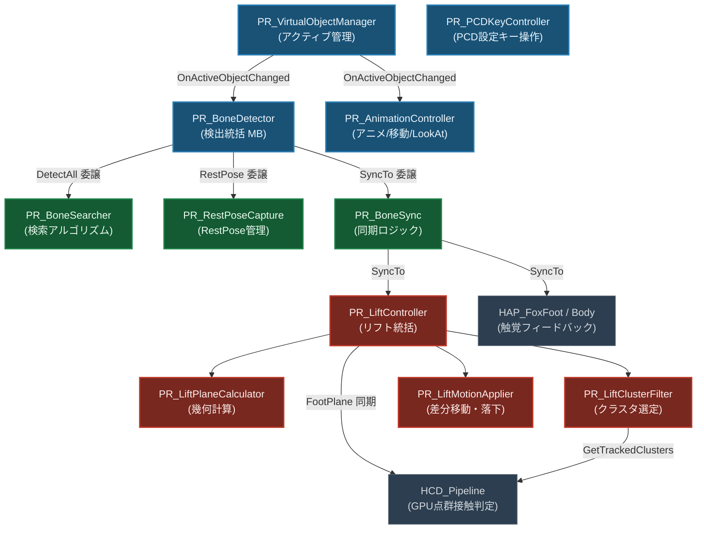
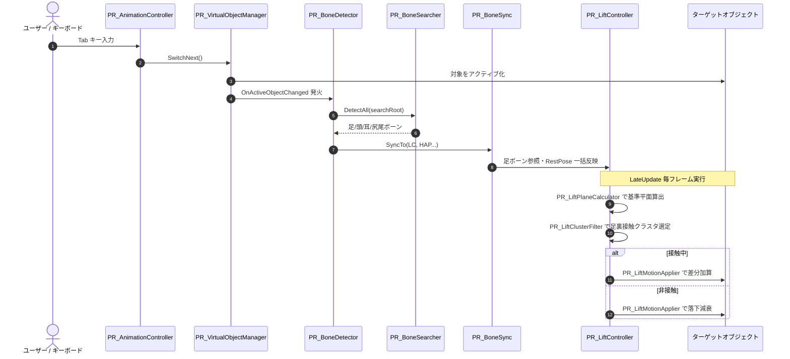

# 物理応答・インタラクションシステム (PhysicalResponse) 仕様書

> 📂 **親ノード**: [Wiki.md](./Wiki.md) | 🏷️ **種類**: 🏗️ システム設計書  
> [RealTimeOcclusion Wiki (ポータル)](./Wiki.md) に戻る

本ドキュメントでは、現実世界の手（RealSense 点群）やユーザー操作に応じて、仮想オブジェクト（Fox 等）のアクティブ切り替え、ボーン検出・一括同期、視線追従、手の平による持ち上げ（Lift）追従・自由落下復帰を提供する**物理応答・インタラクションシステム (`PhysicalResponse`)** について包括的に解説します。

---

## 1. 概要

`PhysicalResponse` システムは、リアルタイム点群処理と Midair Haptics パイプラインを仮想キャラクターの身体表現・操作性と直感的に結びつける統合モジュール群です。Feature-based Architecture に基づいて責務を細粒度に分割し、疎結合かつ保守性の高い設計を実現しています。

### 主な特徴

* **アクティブオブジェクト一元管理 (`PR_VirtualObjectManager`)**: 複数モデル（Fox, Sphere 等）の表示切り替えを Single Source of Truth で統括し、関連コンポーネントへイベント通知します。
* **ボーン自動検出 & 一括同期 (`PR_BoneDetector` + `PR_BoneSearcher`)**: モデル階層から 4 足ボーン・頭・耳・尻尾を自動検出し、アニメーション非依存の基準静止姿勢（Rest Pose）をキャッシュして他コンポーネントへ一元同期します。
* **手の平リフト追従 & 加算方式落下復帰 (`PR_LiftController`)**: 点群クラスタの幾何解析により足裏に近接した手の平を検知し、アニメーションの前進移動を阻害しない差分加算方式でスムーズな持ち上げ追従と自然な着地を実現します。
* **操作制御分離 (`PR_AnimationController` / `PR_PCDKeyController`)**: アニメーション・移動・LookAt 追従と PCD 設定変更を独立したコンポーネントに分離します。

---

## 2. 設計思想・アーキテクチャ

### 2.1 ディレクトリ構成

```text
Assets/Features/PhysicalResponse/
├── Material/                               # マテリアルアセット
├── Prefabs/                                # プレハブアセット
└── Scripts/
    ├── Core/                               # MonoBehaviour コントローラー群
    │   ├── PR_VirtualObjectManager.cs      # アクティブオブジェクト一元管理マネージャ
    │   ├── PR_BoneDetector.cs              # ボーン検出統括・同期 MonoBehaviour
    │   ├── PR_AnimationController.cs       # アニメ制御・移動・LookAt・撮影
    │   └── PR_PCDKeyController.cs          # PCD設定キー操作（M/1〜4/T/O/P/L/K/J/C）
    ├── Bone/                               # ボーン関連純粋 C# クラス群
    │   ├── PR_BoneSearcher.cs             # ボーン名マッチング検索・シーン探索アルゴリズム
    │   ├── PR_RestPoseCapture.cs          # RestPose キャプチャ・同期・ワールド座標復元
    │   └── PR_BoneSync.cs                 # 各コンポーネントへのボーン同期ロジック
    ├── Lift/                               # 手の平持ち上げ（Lift）追従システム
    │   ├── PR_LiftController.cs           # 持ち上げ・追従統括 MonoBehaviour
    │   ├── PR_LiftBoneProvider.cs         # 骨検出依存の解決・フォールバック
    │   ├── PR_LiftPlaneCalculator.cs      # 足4点からの基準平面・バウンディング幾何計算
    │   ├── PR_LiftClusterFilter.cs        # 点群クラスタ判定・重心選定・瞬断バッファ
    │   └── PR_LiftMotionApplier.cs        # 持ち上げ差分加算・感度クランプ・落下減衰
    ├── Response/                           # 物理パラメータ（現在は #if false で無効）
    │   ├── PR_Controller.cs
    │   └── PR_HcdBoneApplier.cs
    ├── Debug/                              # AppLog トリガー
    │   └── PR_LogTriggers.cs              # PR 全体の AppLogManager 登録ヘルパー
    └── Editor/                             # Editor 拡張
        ├── PR_BoneDetectorEditor.cs       # Inspector GUI + SceneGUI Gizmos
        ├── PR_LiftControllerEditor.cs     # リフト追従 Inspector + SceneGUI Gizmos
        └── PR_VirtualObjectManagerEditor.cs
```

### 2.2 クラス相関図



### 2.3 処理フロー



---

## 3. セットアップ・使用方法

### 3.1 クイックスタート手順

#### Step 1: 管理 GameObject の準備

シーン内の管理用 GameObject（例: `PhysicalResponseManager`）に以下のコンポーネントを追加します：

1. `PR_VirtualObjectManager`
2. `PR_BoneDetector`
3. `PR_AnimationController`
4. `PR_PCDKeyController`（`materialController` フィールドを Inspector で設定）
5. `PR_LiftController`
6. `PR_LogTriggers`（AppLogManager 連携が必要な場合）

#### Step 2: 切り替え対象モデルの登録

`PR_VirtualObjectManager` の `Virtual Objects` 配列に切り替え対象モデルを登録します。

#### Step 3: ボーンの一括同期

`PR_BoneDetector` の Inspector で **[Detect Active Target & Bones]** をクリックします。シーン内の `PR_LiftController` や `HAP_FoxFootHapticsController` 等へ足ボーン参照および RestPose が自動伝播されます。

#### Step 4: キーボード操作の確認

下表のキー操作を確認し、`PR_PCDKeyController` の `materialController` に点群マテリアルコントローラーをアタッチします。

---

## 4. 仕様・パラメータ詳細

### 4.1 キーボード操作対応表

#### PR_AnimationController（アニメ・移動・撮影）

| キー | 機能 | 動作詳細 |
|:---:|:---|:---|
| **Tab** | 次のモデルをアクティブ化 | `PR_VirtualObjectManager.SwitchNext()` を呼び出し |
| **Space** | アニメーション一時停止 / 再開 | アクティブモデルの `Animator.speed` を 0 / 1 でトグル |
| **Enter** | マルチマップ & 映像撮影 | オクルージョン関連デバッグマップおよび ViewPoint カメラ映像を同時保存 |
| **W / A / S / D** | オブジェクト水平移動 | ワールド座標系基準で前後左右に移動 |
| **Q / E** | オブジェクト昇降 | ワールド座標系基準で上下に昇降 |
| **F** | LookAt 追従トグル | モデルの Y 軸回転をメインカメラ方向へ自動追従 |
| **Escape** | ゲーム終了 | プレイモード停止またはアプリケーション終了 |

#### PR_PCDKeyController（PCD 設定・Ablation）

| キー | 分類 | 機能 | 動作詳細 |
|:---:|:---:|:---|:---|
| **M** | 手法切替 | 提案手法 / 従来手法 一括切替 | 全 Ablation フラグをまとめて ON / OFF |
| **1** | Ablation | ① タグスキップ最適化 | `enableTagBasedOptimization` トグル |
| **2** | Ablation | ② 密度計算補正 | `enableTypeAwareDensity` トグル |
| **3** | Ablation | ③ ソフトフェード | `enableSoftOcclusionFade` トグル |
| **4** | Ablation | ④ 穴埋め補完切替 | None → JointBilateral → PullPush → Morphology_OC → Morphology_CO |
| **T** | 描画調整 | フェード幅切替 | `occlusionFadeWidth` を 0.0 / 0.2 でトグル |
| **O** | デバッグ | Occlusion Map 表示 | `enableOcclusionMap` トグル |
| **P** | デバッグ | PixelTag Map 表示 | `enablePixelTagMap` トグル |
| **L** | デバッグ | カーネルタイプ切替 | `kernelType` を順次循環 |
| **K** | デバッグ | 評価モード切替 | `evaluationMode` を順次循環 |
| **J** | デバッグ | Min Occluded Sectors | 1〜8 を循環 |
| **C** | 描画調整 | 点群カラーモード切替 | RGB → Depth → Normal 等を順次循環 |

---

### 4.2 バーチャルオブジェクト一元管理仕様 (`PR_VirtualObjectManager`)

| プロパティ名 | 型 | 説明 |
|:---|:---:|:---|
| `virtualObjects` | `GameObject[]` | 切り替え対象となる仮想オブジェクトの配列 |
| `defaultActiveIndex` | `int` | 起動時にアクティブにするオブジェクトのインデックス |
| `allowTabSwitch` | `bool` | `Tab` キーによる自己切り替えを許可するか |
| `ActiveObject` | `GameObject` | 現在アクティブなオブジェクト（読み取り専用） |
| `ActiveTransform` | `Transform` | 現在アクティブなオブジェクトの Transform（読み取り専用） |
| `ActiveAnimator` | `Animator` | 現在アクティブなオブジェクトの Animator（読み取り専用） |
| `OnActiveObjectChanged` | `event Action<GameObject>` | オブジェクト切り替え時の通知イベント |

---

### 4.3 ボーン自動検出・同期仕様

#### PR_BoneDetector（MonoBehaviour）

| プロパティ名 | 型 | 説明 |
|:---|:---:|:---|
| `targetTransform` | `Transform` | ボーン探索のルート Transform |
| `frontLeftFoot` / `frontRightFoot` | `Transform` | 前足（左/右）の末端ボーン |
| `backLeftFoot` / `backRightFoot` | `Transform` | 後足（左/右）の末端ボーン |
| `headBone` / `leftEarBone` / `rightEarBone` / `tailBone` | `Transform` | 頭・耳・尻尾ボーン |
| `autoDetectActiveModel` | `bool` | 非アクティブ検出時に自動再検出するか |
| `HasRestPose` | `bool` | RestPose キャプチャ済みか（読み取り専用） |

#### 分割クラスの責務

| クラス | 種別 | 責務 |
|:---|:---:|:---|
| `PR_BoneSearcher` | 純粋 C# static | ボーン名マッチング・シーン探索・IsBonesValid |
| `PR_RestPoseCapture` | 純粋 C# class | RestPose キャプチャ・エディタ同期・ワールド座標復元 |
| `PR_BoneSync` | 純粋 C# static | LC / HAP 各コンポーネントへのフィールド同期 |

<details>
<summary>💡 アニメーション非依存基準ポーズ (Rest Pose) の数理モデル</summary>

キャラクターがアニメーション（走る・ジャンプする等）を実行している際、ボーンのワールド座標は常に変動します。そのまま足平面を計算すると手が静止していてもキャラクターが揺れてしまいます。  
本システムでは静止ポーズ時のボーンローカル座標 $\mathbf{p}_{\text{local}}$ を保持し、現在のキャラクターのワールド変換行列 $\mathbf{M}_{\text{target}}$ を介してアニメーション非依存の足位置 $\mathbf{p}_{\text{world}}$ を復元します：

$$\mathbf{p}_{\text{world}} = \mathbf{M}_{\text{target}} \cdot \mathbf{p}_{\text{local}}$$

</details>

---

### 4.4 リフト追従・落下復帰仕様 (`PR_LiftController` & プロセッサ群)

#### インスペクターパラメータ

| 設定項目 | 型 | 既定値 | 説明 |
|:---|:---:|:---:|:---|
| `liftMode` | `LiftCalculationMode` | `InitialPositionPlusLift` | 持ち上げ計算モード（`InitialPositionPlusLift`: 初期位置+変位 / `IncrementalDelta`: フレーム間差分） |
| `liftSensitivity` | `float` | `1.0` | 上方向への持ち上げ感度（下方向は等倍） |
| `minLiftHeight` | `float` | `0.0` | 最小持ち上げ高さ（m） |
| `maxLiftHeight` | `float` | `0.3` | 最大持ち上げ高さ（m） |
| `followHorizontalHand` | `bool` | `false` | 手の水平移動にも追従するか |
| `maxLiftDelta` | `float` | `0.05` | 1フレームあたりの最大変位限界値（m） |
| `maxCentroidJump` | `float` | `0.15` | 急激な飛び移りとみなす重心距離閾値（m） |
| `planeMargin` | `float` | `0.03` | 足4点四角形外側マージン（m） |
| `underPlaneDepthThreshold` | `float` | `0.05` | 平面より下部の抽出深さ閾値（m） |
| `upperPlaneMargin` | `float` | `0.005` | 平面より上部の許容マージン（m） |
| `fallSpeed` | `float` | `2.0` | 手が離脱した際の接地落下速度（m/s） |

#### 分割プロセッサの責務

1. **`PR_LiftPlaneCalculator`**: 4 足位置から重心・法線ベクトル・バウンディングボックスを算出します。
2. **`PR_LiftClusterFilter`**: 法線方向符号付き距離 $d$ を評価し、手の平クラスタを選定します。瞬断バッファにより最大 4 フレームの追跡維持を行います。
3. **`PR_LiftMotionApplier`**: 差分加算方式 $\Delta h = h_{\text{target}} - h_{\text{applied}}$ のみを `position +=` で加算し、アニメーション・移動を阻害しません。空中再接触時の高さ引き継ぎも担います。

---

## 5. デバッグ・留意事項

### 5.1 デバッグ Gizmo 可視化

| コンポーネント | Gizmo 内容 |
|:---|:---|
| `PR_LiftController` (選択時) | 足 4 点・平面法線・抽出ボリューム（非接触: シアン / 接触中: 緑）・クラスタ重心（マゼンタ） |
| `PR_BoneDetector` (選択時) | 足 4 点（黄）・頭（マゼンタ）・耳（シアン）・尻尾（緑）・各ラベル表示 |

### 5.2 統制ログ管理 (`AppLogManager`) 連携

本システムはプロジェクト共通の統制ログ規約 (`AppLogger`) に完全準拠しています。インスペクターに個別のデバッグログトグルは配置せず、`AppLogManager` から一括監視が可能です。`PR_LogTriggers` を Scene 内にアタッチすることで以下のサブトリガーが自動登録されます。

| サブトリガー (`subTag`) | 登録コンポーネント | 出力内容 |
|:---|:---:|:---|
| `PR_LiftController` | `PR_LiftController` | 接触開始・追従中重心・落下状態 |
| `PR_BoneDetector` | `PR_BoneDetector` | ボーン検出結果・同期通知 |
| `PR_VirtualObjectManager` | `PR_VirtualObjectManager` | モデル切り替えイベント |
| `PR_AnimationController` | `PR_AnimationController` | アニメ制御・撮影・移動操作ログ |
| `PR_PCDKeyController` | `PR_PCDKeyController` | PCD 設定変更ログ |

> 📎 ログ設定の詳細は [Logging.md](./Logging.md) を参照してください。

### 5.3 トラブルシューティング

<details>
<summary>Q1. 手をかざしてもキツネが持ち上がらない</summary>

1. `HCD_Pipeline` がシーン内に存在し、点群クラスタリングが動作しているか確認してください。
2. Scene ビューで `PR_LiftController` の Gizmo を確認し、手の平がシアン色の直方体ボリューム内に入っているか確認してください。ボリュームが狭い場合は `planeMargin` または `underPlaneDepthThreshold` を広げてください。
3. `PR_BoneDetector` の足 4 点が正しく設定されているか確認してください（未設定の場合は [Detect Active Target & Bones] を実行）。

</details>

<details>
<summary>Q2. 持ち上げ中に手が静止しているのにキツネが揺れる・下がる</summary>

1. `PR_LiftController` の `Lift Mode` が `InitialPositionPlusLift` になっていることを確認してください。
2. `PR_BoneDetector` の `HasRestPose` が `true` であることを確認してください。`false` の場合は静止姿勢の状態で [Detect Active Target & Bones] を再実行してください。

</details>

<details>
<summary>Q3. キーボードの W/A/S/D やアニメーションでキツネが前に進まない</summary>

1. `PR_LiftController` が `LateUpdate()` で動作していることを確認してください（`Update()` ではありません）。
2. `PR_LiftMotionApplier` が差分加算方式（絶対座標の上書きではなくオフセット差分のみを加算）で動作していることを確認してください。

</details>

<details>
<summary>Q4. PCD 設定キー（M / 1〜4 / T 等）が反応しない</summary>

`PR_PCDKeyController` コンポーネントがシーン内の GameObject にアタッチされているか確認してください。旧 `PR_AnimationController` には PCD 設定キーは含まれていません。

</details>
