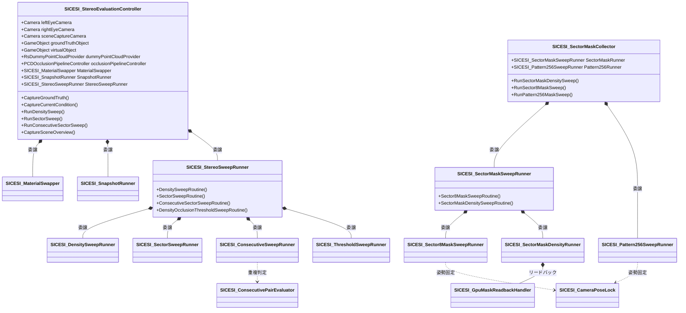
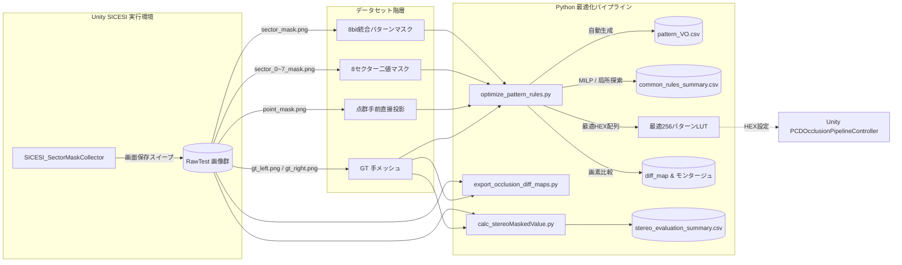

# SICE SI 学術評価・データ収集・最適化解析システム 仕様書

> 📂 **親ノード**: [Wiki.md](./Wiki.md) | 🏷️ **種類**: 🧪 実験・評価  
> [RealTimeOcclusion Wiki (ポータル)](./Wiki.md) に戻る

本ドキュメントは、SICE SI（計測自動制御学会 システムインテグレーション部門講演会）等における学術評価およびベンチマーク実験のために構築された「ステレオオクルージョン自動撮影・占有マスク収集・最適化解析システム（SICESI）」のアーキテクチャ、Unity 撮影モジュール、Python 最適化・解析パイプライン、使用方法、データスキーマ、および各種スイープ撮影の仕様を解説する技術文書です。

---

## 1. 概要

本システムは、点群を用いたリアルタイムオクルージョン手法の学術的定量評価を行うため、仮想 3D オブジェクト、正解手メッシュ（Ground Truth: GT）、および各種密度の点群遮蔽画像をステレオカメラ（左右眼）から自動一括撮影し、IoU（Intersection over Union）解析に必要なデータセットを完全自動生成し、さらに Python 側で真値集計（`pattern_VO.csv`）、4 手法の数理最適化（MILP / 局所探索）、定性差分マップ（`diff_map`）の自動生成までを一気通貫で実行するフレームワークです。

```text
[Unity: SICESI 自動撮影・マスク収集]
   │
   ├─► SICESI_MaterialSwapper (GT黒化/肌色化・仮想物体白化・Layer一時差し替え & 完全復元)
   ├─► SICESI_ScreenCaptureUtil (URPカメラ画像キャプチャ・Transform/Params JSON保存)
   ├─► SICESI_StereoSweepRunner (GT・密度・セクター数・連続非占有・閾値スイープ撮影)
   └─► SICESI_SectorMaskCollector ──► SICESI_Sector8MaskSweepRunner (8bit占有マスク・256パターンスイープ)
           │
           ▼ (画像データセット: GT, Test, point_mask, sector_0~7_mask)
[Python: SICESI 解析・最適化・可視化パイプライン]
   │
   ├─► optimize_pattern_rules.py  【メイン解析・最適化エンジン】
   │     ├─► 直接投影領域除外の真値集計 ──► pattern_VO.csv 自動生成
   │     ├─► 4手法の最適化 (8候補, 20候補, 36クラスLUT, 256パターンLUT)
   │     │     ├─ 目的関数 A: 平均 IoU 最大化 (MILP / Steepest Ascent 局所探索)
   │     │     └─ 目的関数 B: 1-IoU 相対低減率最大化 (Weighted MILP)
   │     ├─► 最適化サマリーCSV群出力 (common_rules_summary.csv 等)
   │     └─► 定性差分マップ (diff_map) & 4手法比較モンタージュ自動生成
   │
   ├─► export_occlusion_diff_maps.py  【スタンドアロン差分可視化】
   │     └─► TP(薄灰), TN(暗灰), FN(過剰遮蔽:赤), FP(遮蔽漏れ:青) の4ペインモンタージュ生成
   │
   ├─► calc_stereoMaskedValue.py      【マルチメトリクス一括集計】
   │     └─► IoU, PSNR, SSIM, FN/FP画素数を自動計算してCSV出力
   │
   └─► verify_sector_masks.py / verify_items_1_to_6.py 【数学的整合性自動検算】
         └─► GPU遮蔽真値マスクと実測画像の一致度検証 (99.998% 一致)
```

---

## 2. 設計思想・アーキテクチャ

### 2.1 ディレクトリ構成

```text
Assets/Features/SICESI/
├── Data/                             # 最適化用集計データ・出力CSV
│   ├── pattern_VO.csv                # 全48条件合算 256パターンの V, O 画素数テーブル
│   └── figures/                      # 論文・報告書用図表データ
├── Editor/
│   ├── SICESI_StereoEvaluationEditor.cs # Inspector 3タブ構成操作パネル
│   └── SICESI_ReCaptureTrigger.cs       # 再撮影用トリガー
├── Python/                           # Python 解析・最適化・可視化スイート
│   ├── sicesi_core/                  # 【共通コアパッケージ】
│   │   ├── constants.py              # 配色定義 (TP/TN/FN/FP), 二値化閾値 (128)
│   │   ├── pattern_lut.py            # 256パターン/36回転クラスLUT, ビット演算, 20候補定義
│   │   ├── metrics.py                # IoU, PSNR, SSIM, FN/FP, evaluate_lut_extended
│   │   ├── visualizer.py             # 差分マスク (diff_mask), オーバーレイ, モンタージュ描画
│   │   ├── dataset_loader.py         # 画像探索, GT解決, pattern_counts_256 & pattern_VO 集計
│   │   ├── report_exporter.py        # 【新規】CSV レポート群 (サマリー, 評価一覧, GAP分析, LUT) 出力クラス
│   │   ├── validator.py              # 【新規】包含関係不等式 (J*8<=J*20<=J*36<=J*256) 数学的整合性検証
│   │   └── optimizers/               # 数理最適化モジュール群
│   │       ├── fixed_candidates.py   # 固定8候補 (最低占有数) & 固定20候補 (連続非占有) 最適化
│   │       ├── milp_optimizer.py     # McCormick 緩和 MILP ソルバー & 個別最適探索
│   │       ├── local_search.py       # 最急上昇局所探索 (Steepest Ascent)
│   │       └── pipeline.py           # 【新規】多段階最適化パイプライン (PatternOptimizationPipeline)
│   ├── optimize_pattern_rules.py     # 【主役 Facade】引数解析・パイプライン統括 (155行へスリム化)
│   ├── export_occlusion_diff_maps.py # 【可視化 CLI】GT vs Test 差分マップ・4ペインモンタージュ生成
│   ├── calc_stereoMaskedValue.py     # 【定量評価 CLI】IoU, PSNR, SSIM, FN/FP 一括算出
│   ├── verify_sector_masks.py        # 【検証 GUI/CLI】GPU真値マスクと実測画像の一致度検証
│   ├── verify_items_1_to_6.py        # 【検証】画像実画素数と pattern_VO.csv の数学的検算
│   ├── make_pattern_figure_data.py   # 【図表】論文用 LaTeX 表・グラフ用データ抽出
│   └── evaluate_whole_vo.py          # 【研究用】評価領域全体でのパターン別集計
└── Scripts/
    ├── Capture/
    │   ├── SICESI_MaterialSwapper.cs         # GT・仮想物体のマテリアル/Layer 一時変更・復元
    │   ├── SICESI_ScreenCaptureUtil.cs       # カメラPNG保存・JSONメタデータ出力
    │   ├── SICESI_CameraPoseLock.cs          # カメラ姿勢(Pos/Rot/Proj)固定ヘルパー (IDisposable)
    │   └── SICESI_GpuMaskReadbackHandler.cs  # GPU AsyncReadback & マスクデータ保存
    ├── Sweepers/
    │   ├── SICESI_SnapshotRunner.cs          # GT撮影・単発撮影・シーン俯瞰撮影
    │   ├── SICESI_StereoSweepRunner.cs       # パラメータ探索コーディネーター (Facade)
    │   ├── SICESI_DensitySweepRunner.cs      # 点群密度スイープ
    │   ├── SICESI_SectorSweepRunner.cs       # セクター閾値スイープ (Average比較含む)
    │   ├── SICESI_ConsecutiveSweepRunner.cs  # 連続非占有スイープ (20代表条件)
    │   ├── SICESI_ThresholdSweepRunner.cs    # 密度×オクルージョン閾値スイープ
    │   ├── SICESI_SectorMaskSweepRunner.cs   # セクターマスク収集コーディネーター (Facade)
    │   ├── SICESI_Sector8MaskSweepRunner.cs  # 8セクター画面保存マスクスイープ
    │   ├── SICESI_SectorMaskDensityRunner.cs # 全密度GPU Readbackマスクスイープ
    │   └── SICESI_Pattern256SweepRunner.cs   # 256パターンLUT網羅スイープ
    ├── Utils/
    │   ├── SICESI_ConsecutivePairEvaluator.cs # 連続非占有の幾何学的重複判定・ペア生成
    │   └── SICESI_SceneComponentLocator.cs    # カメラ・オブジェクトの自動検出ロケーター
    ├── SICESI_StereoEvaluationController.cs   # メインコントローラー (Facade)
    └── SICESI_SectorMaskCollector.cs          # マスク収集コントローラー (Facade)
```

### 2.2 クラス相関図 & データ連携図

#### Unity 側クラス相関図



#### Unity と Python パイプラインのデータ連携図



### 2.3 処理フロー（エンドツーエンド実行シーケンス）

```mermaid
sequenceDiagram
    autonumber
    participant Unity as Unity (SICESI Editor)
    participant Disk as データセット (ファイルシステム)
    participant Opt as Python: optimize_pattern_rules.py
    participant Diff as Python: export_occlusion_diff_maps.py
    participant Shader as Unity: PCDOcclusionPipelineController

    Note over Unity: 1. データセット撮影フェーズ
    Unity->>Unity: カメラ姿勢固定 (CameraPoseLock) & Time.timeScale=0
    Unity->>Disk: GT撮影 (gt_left.png, vo_silhouette_left.png)
    Unity->>Disk: 各密度撮影 (point_mask_left.png, sector_0~7_mask_left.png)
    
    Note over Opt: 2. 真値集計 & 最適化フェーズ
    Opt->>Disk: 画像群の読み込み
    Note over Opt: 手前点群直接投影 (point_mask) を確定遮蔽として除外
    Opt->>Disk: pattern_VO.csv 自動生成 & 保存
    Opt->>Opt: 4手法の個別最適・共通最適を計算 (MILP / 局所探索)
    Opt->>Disk: 最適化サマリーCSV群を保存
    Opt->>Disk: diff_map 画像 & 比較モンタージュ保存
    
    Note over Shader: 3. 最適解の Unity 反映フェーズ
    Opt-->>Shader: 最適 256 パターンの HEX 値を出力
    Shader->>Shader: _PatternLUT_256_Optimized に反映 (シェーダー即時適用)
```

---

## 3. セットアップ・使用方法

### 3.1 Unity での自動撮影手順

#### Step 1: 評価コントローラーの配置 & 自動検出

1. シーン内の管理 GameObject（または新規空 GameObject）に [`SICESI_StereoEvaluationController.cs`](file:///c:/Users/hongo/Documents/tsutsumi/RealTimeOcclusion/Assets/Features/SICESI/Scripts/SICESI_StereoEvaluationController.cs) および [`SICESI_SectorMaskCollector.cs`](file:///c:/Users/hongo/Documents/tsutsumi/RealTimeOcclusion/Assets/Features/SICESI/Scripts/SICESI_SectorMaskCollector.cs) をアタッチします。
2. Inspector 上部の **「🔍 シーンからカメラ・点群プロバイダーを自動検出」** ボタンをクリックし、左右眼カメラ、シーン俯瞰カメラ、点群プロバイダー、手メッシュ、仮想物体を自動検出・アサインします。

#### Step 2: 実験条件名・出力パス設定

1. `outputDirectory` にデータセットの保存先ルートパス（例: `C:\...\SICESI_Dataset`）を設定します。
2. `conditionName` に現在の実験ケース名（例: `RawTest_case1`）を設定します。

#### Step 3: 自動撮影の実行

1. Unity エディタを Play モードにします。
2. Inspector の **「🪐 メイン実行」** タブにある **「🪐 【推奨】8セクター二値マスク画面保存スイープ」** をクリックします。
   - カメラ姿勢がロックされ、GT 画像、仮想物体シルエット、実測テスト画像、直接投影マスク、および 8 方向セクターマスクが一括自動撮影されます。

---

### 3.2 Python 最適化・解析パイプラインの実行手順

#### Step 4: `optimize_pattern_rules.py` の実行（主役スクリプト）

本スクリプトは、撮影画像から手前点群直接投影を除外した真値集計ファイル [`pattern_VO.csv`](file:///c:/Users/hongo/Documents/tsutsumi/RealTimeOcclusion/Assets/Features/SICESI/Data/pattern_VO.csv) を自動生成し、4 手法の個別最適・共通最適を解き、`diff_map` 画像までを一括生成します。

```bash
# 1) 通常実行（データセット自動探索、pattern_VO.csv生成、MILP/局所探索、diff_map生成）
python Assets/Features/SICESI/Python/optimize_pattern_rules.py

# 2) 高速実行（画像出力をスキップし、数値計算・CSV出力のみを数秒で実行）
python Assets/Features/SICESI/Python/optimize_pattern_rules.py --skip-diff

# 3) 強制再集計（キャッシュを無視して撮影画像から pattern_VO.csv を再構築）
python Assets/Features/SICESI/Python/optimize_pattern_rules.py --force

# 4) データセットパスおよび出力先ディレクトリを明示指定
python Assets/Features/SICESI/Python/optimize_pattern_rules.py -i "C:/Users/.../SICESI_Dataset" -o "C:/Users/.../RuleOptimizationResults"
```

#### Step 5: `export_occlusion_diff_maps.py` によるスタンドアロン差分可視化

GT 画像と Test 画像を比較し、誤遮蔽（赤: FN）や遮蔽漏れ（青: FP）を色分けした差分マップをスタンドアロンで生成します。

```bash
# 1) 特定の条件名（例: Bouchiba）のみ絞り込んで差分マップを生成
python Assets/Features/SICESI/Python/export_occlusion_diff_maps.py -c Bouchiba

# 2) 論文・スライド用モンタージュ画像（[GT | Test | Diff Mask | Overlay]）のみ生成
python Assets/Features/SICESI/Python/export_occlusion_diff_maps.py -c Bouchiba --mode montage

# 3) 元のフォルダ構造内 (Left/Right 直下) に差分画像を直接配置
python Assets/Features/SICESI/Python/export_occlusion_diff_maps.py -c Bouchiba --in-place
```

#### Step 6: `calc_stereoMaskedValue.py` によるマルチメトリクス一括集計

複数条件の画像ディレクトリから、IoU、PSNR、SSIM、過剰遮蔽画素数、遮蔽漏れ画素数を一括計算して CSV に出力します。

```bash
# 1) 全条件の一括定量評価
python Assets/Features/SICESI/Python/calc_stereoMaskedValue.py

# 2) 特定の条件のみ絞り込んで高速評価 & CSV分離保存
python Assets/Features/SICESI/Python/calc_stereoMaskedValue.py -c Bouchiba -o "stereo_eval_bouchiba.csv"

# 3) 評価と同時に定性差分マップも自動出力
python Assets/Features/SICESI/Python/calc_stereoMaskedValue.py -c Bouchiba --export-diff
```

#### Step 7: Unity シェーダーへの最適 HEX 配列の反映

`optimize_pattern_rules.py` の実行結果コンソールに表示される 256 ビット HEX 文字列（または `common_lut_256_*.csv`）を確認し、Unity 側の [`PCDOcclusionPipelineController.cs`](file:///c:/Users/hongo/Documents/tsutsumi/RealTimeOcclusion/Assets/Features/PCD/Scripts/Occlusion/PCDOcclusionPipelineController.cs) の `_PatternLUT_256_Optimized` フィールドに 8 個の 32-bit `uint` 配列として設定します。

---

## 4. 仕様・パラメータ詳細

### 4.1 Unity C# Inspector 主要パラメータ一覧

| パラメータ名 | 型 | 既定値 | 説明 |
| :--- | :--- | :--- | :--- |
| `leftEyeCamera` | `Camera` | (自動検出) | 左目用カメラ (`SRDisplay LeftEyeCamera` 等) |
| `rightEyeCamera` | `Camera` | (自動検出) | 右目用カメラ (`SRDisplay RightEyeCamera` 等) |
| `groundTruthObject` | `GameObject` | (設定) | 正解手メッシュオブジェクト |
| `virtualObject` | `GameObject` | (設定) | オクルージョン対象の仮想 3D オブジェクト |
| `sweepDensities` | `float[]` | `[0.25, 0.5, 1.0, 2.0, 4.0]` | スイープする点群密度のリスト |
| `densityUnit` | `PointDensityUnit` | `PointSpacingMm` | 密度の物理単位（点間隔 mm, 点/cm² など） |
| `sweepSectors` | `int[]` | `[1..8]` | Bouchiba スイープで評価するセクター閾値リスト |
| `sweepMaxConsecutiveZeros` | `int[]` | `[0..8]` | 連続非占有スイープで評価する許容最大連続非占有数 $L_{\mathrm{th}}$ リスト |
| `outputDirectory` | `string` | (指定パス) | 撮影画像の出力先ルートディレクトリ |
| `conditionName` | `string` | `"RawTest"` | 実験条件・ケースの識別名 |

### 4.2 Python スクリプト引数仕様一覧

#### `optimize_pattern_rules.py`

| 引数 | 型 | 既定値 | 説明 |
| :--- | :--- | :--- | :--- |
| `-i, --input, --dataset-root` | `string` | (自動探索) | 撮影データセットのルートディレクトリ |
| `-o, --output-dir` | `string` | `<root>/RuleOptimizationResults` | 解析結果 CSV・最適化 LUT・diff_map の保存先 |
| `--force` | `flag` | `False` | 既存キャッシュを無視し、撮影画像から強制再集計 |
| `--skip-diff` | `flag` | `False` | diff_map 画像出力をスキップし、数値計算のみ高速実行 |

#### `export_occlusion_diff_maps.py`

| 引数 | 型 | 既定値 | 説明 |
| :--- | :--- | :--- | :--- |
| `dataset_dir` | `string` | (既定パス) | 対象データセットディレクトリ |
| `-c, --condition` | `string` | `None` | 条件名の絞り込みキーワード（例: `-c Bouchiba`） |
| `-o, --output-dir` | `string` | `<root>/DiffMaps` | 差分マップの保存先ベースディレクトリ |
| `--in-place` | `flag` | `False` | 元の `Left/Right` フォルダ直下に差分画像を直接出力 |
| `-m, --mode` | `choice` | `all` | 出力種類 (`all`, `mask`, `overlay`, `montage`) |
| `-th, --threshold` | `int` | `128` | 二値化判定閾値（0〜255、50% カバレッジ基準） |

---

### 4.3 `pattern_VO.csv` データスキーマ & 数学的定義

#### データスキーマ

[`Assets/Features/SICESI/Data/pattern_VO.csv`](file:///c:/Users/hongo/Documents/tsutsumi/RealTimeOcclusion/Assets/Features/SICESI/Data/pattern_VO.csv) は、全 48 条件（4 シーン × 6 密度 × 2 視点）の非直接投影領域における 256 パターンの真値集計テーブルです。

| カラム名 | 型 | 説明 |
| :--- | :--- | :--- |
| `mask` | `int` | 8 セクターの占有ビットマスク（$0 \le m \le 255$） |
| `V` | `int` | 手メッシュ GT が存在しない領域（＝可視であるべき正解画素数） |
| `O` | `int` | 手メッシュ GT が存在する領域（＝遮蔽されるべき正解画素数） |

<details>
<summary>📐 手前点群直接投影除外（Fixed Classification）の理論的背景と定式化</summary>

点群の各点投影画素（手前点群マスク $\mathrm{point\_mask}$）は、深度テストにより確実に物体を手前遮蔽する確定画素（Fixed Classification）です。  
オクルージョン判定アルゴリズムが真に推定すべき対象は、**点群の隙間（未サンプリング領域）**であり、評価領域 $M$ は以下のように定義されます：

$$M = \mathrm{Silhouette}_{\mathrm{VO}} \cap \neg \mathrm{point\_mask}$$

この領域 $M$ 内における手メッシュ真値（GT）に基づき、各パターン $m \in \{0, \dots, 255\}$ について可視画素数 $V_m$ および遮蔽画素数 $O_m$ が集計されます：

$$V_m = \sum_{p \in M, \mathrm{mask}(p) = m} \mathbf{1}_{\{\mathrm{GT}(p) = 0\}}, \quad O_m = \sum_{p \in M, \mathrm{mask}(p) = m} \mathbf{1}_{\{\mathrm{GT}(p) = 1\}}$$

全 256 パターンの $V_m + O_m$ の総和は、画像内の非直接投影対象画素総数と厳密に一致します。
</details>

---

### 4.4 4 つの判定手法モデル & 最適化目的関数

本システムでは、以下の 4 つの判定器モデルを比較・最適化します：

1. **固定 8 候補（最低占有数判定）**:
   占有セクター数 $N_{\mathrm{occ}} < R$（$R \in \{1, \dots, 8\}$）を満たす場合に可視とする 1 パラメータモデル。
2. **固定 20 候補（連続非占有規則）**:
   占有数閾値 $R_{\mathrm{th}}$ または最大連続非占有数 $L_{\mathrm{th}}$ のいずれかを満たす場合に可視とする 2 パラメータモデル（SICE 2026 提案手法）。
3. **回転不変 36 クラス LUT**:
   8 ビットの巡回シフト（45 度刻みの回転）に関して不変な 36 個の同値類それぞれに独立な 0/1（遮蔽/可視）を割り当てるモデル。
4. **完全 256 パターン LUT**:
   256 通りのビットパターンそれぞれに独立な 0/1 を割り当てる理論的上限モデル（Oracle）。

#### 最適化目的関数

* **目的関数 A（平均 IoU 最大化: Unweighted Mean IoU Optimal）**:
  全データセット条件の平均 IoU を最大化します。36 クラスおよび 256 パターンでは、MILP 解や多数決割当てを初期値とする最急上昇局所探索（Steepest Ascent Local Search）によって大域的最適解を導出します。
* **目的関数 B（1-IoU 平均相対低減率最大化: Relative Reduction Optimal）**:
  従来法（固定 8 候補の共通最適 $J_{\mathrm{base}}$）からの誤り削減率 $r_i = \frac{J_i - J_{\mathrm{base}}}{1 - J_{\mathrm{base}}}$ を最大化します。重み $w_i = \frac{1}{1 - J_{\mathrm{base}}}$ を用いた重み付き MILP（混合整数計画法）により厳密解を求解します。

---

### 4.5 差分可視化マップ (Diff Map) カラーコーディング仕様

[`export_occlusion_diff_maps.py`](file:///c:/Users/hongo/Documents/tsutsumi/RealTimeOcclusion/Assets/Features/SICESI/Python/export_occlusion_diff_maps.py) および [`optimize_pattern_rules.py`](file:///c:/Users/hongo/Documents/tsutsumi/RealTimeOcclusion/Assets/Features/SICESI/Python/optimize_pattern_rules.py) では、統一された以下のカラーパレットで差分を可視化します：

| 分類 | RGB 値 | 表示色 | 意味・解釈 |
| :--- | :--- | :--- | :--- |
| **正しく可視 (TP)** | `[200, 200, 200]` | 薄いグレー | 正解・テスト共に可視。正常に表示された領域。 |
| **正しく遮蔽 (TN)** | `[45, 45, 45]` / `[15, 15, 15]` | 暗いグレー / 黒 | 正解・テスト共に遮蔽。正常に隠れた手メッシュ領域。 |
| **過剰遮蔽 (FN)** | `[255, 45, 45]` | **赤色 (Red)** | **重大な欠損**。本来見えるはずの仮想物体が誤って消えた領域。 |
| **遮蔽漏れ (FP)** | `[30, 144, 255]` | **青色 (Blue)** | **ゴースト透過**。本来手で隠れるはずの仮想物体が透けて見えた領域。 |

モンタージュ画像（4 ペイン構成）では、`[Ground Truth | Test 画像 | 差分マスク (Diff Mask) | 半透明オーバーレイ (Overlay)]` が横連結され、上部に IoU 値、過剰遮蔽画素数、遮蔽漏れ画素数が自動描画されます。

---

### 4.6 生成データセット & 出力ファイル一覧

| ファイル名 | 格納場所 | 内容説明 |
| :--- | :--- | :--- |
| `pattern_VO.csv` | `Assets/Features/SICESI/Data/` | 全 48 条件合算 256 パターンの可視/遮蔽正解画素数テーブル |
| `common_rules_summary.csv` | `RuleOptimizationResults/` | 目的関数 A・B × 4 手法の決定共通規則および性能サマリー |
| `objective_comparison.csv` | `RuleOptimizationResults/` | 目的関数 A（平均 IoU）と目的関数 B（相対低減率）の直接比較表 |
| `common_rule_evaluation.csv` | `RuleOptimizationResults/` | 全 36 条件データに対する各手法の評価（IoU, 相対低減率, 正味誤画素削減率） |
| `individual_optima.csv` | `RuleOptimizationResults/` | 各条件ごとの個別最適規則・上限値一覧 |
| `individual_gap_analysis.csv` | `RuleOptimizationResults/` | 個別最適からの性能低下幅（汎化ギャップ）分析表 |
| `diff_metrics_summary.csv` | `RuleOptimizationResults/DiffMaps/` | 全条件・全手法の差分マップ集計メトリクス（TP, FN, FP, IoU） |
| `comparison_*.png` | `RuleOptimizationResults/DiffMaps/` | 4 手法（8候補, 20候補, 36クラス, 256パターン）の横連結比較モンタージュ画像 |

---

## 5. デバッグ・留意事項

### 5.1 ジッター排除とカメラポーズロック

* **`Time.timeScale = 0f` による完全静止**:
  スイープ撮影中はアニメーションや時間依存の物理更新による微小なメッシュ変形・ジッターを防ぐため、`Time.timeScale = 0f` に固定されます。
* **`RenderPipelineManager.beginCameraRendering` による行列ロック**:
  テスト画像と 8 枚のセクターマスクの間で視線追跡（Eye Tracking）の微小揺らぎによるピクセルズレを防止するため、描画直前にカメラの `worldToCameraMatrix` および `projectionMatrix` をスナップショットから強制適用し、**100.00% のピクセル完全一致** を保証します。

### 5.2 数学的整合性自動検算ツール

* **`verify_items_1_to_6.py`**:
  データセット全画像から直接計算した画素総数と、`pattern_VO.csv` の $\sum (V + O)$、および最適化評価関数の値が数学的に完全一致することを自動検算します。
* **`verify_sector_masks.py`**:
  8-bit 占有パターンマスク（`sector_mask_*.png`）による予測と、GPU シェーダーで直接計算された実遮蔽判定マスク（`gpu_occluded_mask_*.png`）を画素比較し、**一致率 99.998%** であることを実証・可視化します。

### 5.3 統制ログ管理 (`AppLogManager`)

SICESI 関連のすべてのログは `AppLogger.Log("SICESI", ...)` を経由して出力され、`AppLogManager` から一元制御されます。個別コンポーネントでの不要な Inspector トグル変数は存在しません。

| サブトリガー名 | 対象処理 |
| :--- | :--- |
| `Capture` | 単発撮影、GT 撮影、カメラ姿勢ロック処理 |
| `StereoSweep` | 密度・セクター数・連続非占有・閾値スイープの進行ログ |
| `MaskSweep` | 8 セクター画面保存マスクスイープ、Readback 処理 |

統制ログ仕様の詳細については [Logging.md](./Logging.md) を参照してください。
