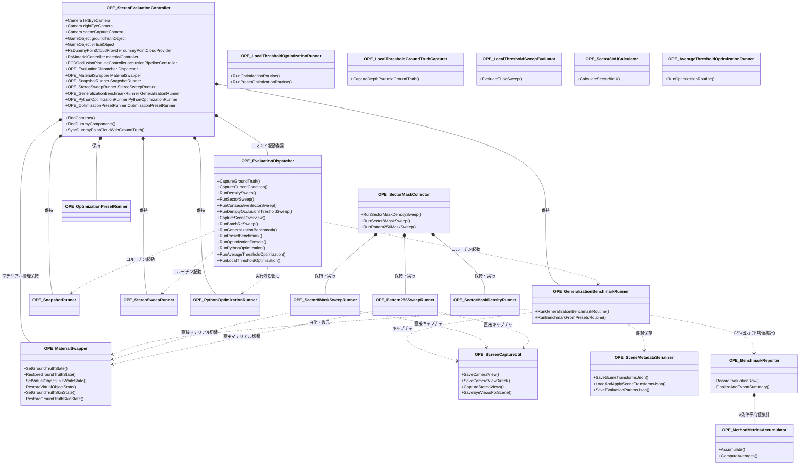
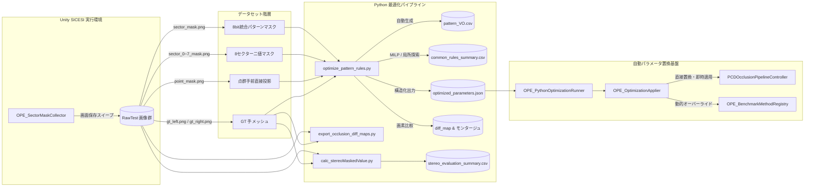
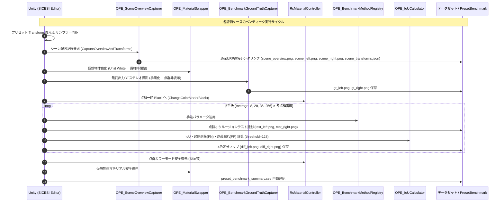
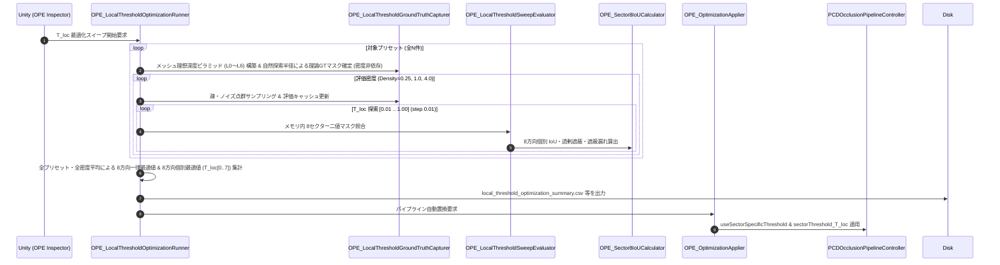
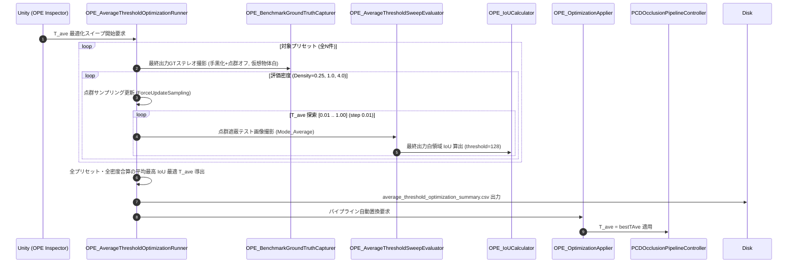

# SICE SI 学術評価・データ収集・最適化解析システム 仕様書

> 📂 **親ノード**: [Wiki.md](./Wiki.md) | 🏷️ **種類**: 🧪 実験・評価  
> [RealTimeOcclusion Wiki (ポータル)](./Wiki.md) に戻る

本ドキュメントは、SICE SI（計測自動制御学会 システムインテグレーション部門講演会）等における学術評価およびベンチマーク実験のために構築された「ステレオオクルージョン自動撮影・占有マスク収集・最適化解析システム（SICESI）」のアーキテクチャ、Unity 撮影モジュール、Python 最適化・解析パイプライン、使用方法、データスキーマ、および各種スイープ撮影の仕様を解説する技術文書です。

---

## 1. 概要

本システムは、点群を用いたリアルタイムオクルージョン手法の学術的定量評価を行うため、仮想 3D オブジェクト、正解手メッシュ（Ground Truth: GT）、および各種密度の点群遮蔽画像をステレオカメラ（左右眼）から自動一括撮影し、IoU（Intersection over Union）解析に必要なデータセットを完全自動生成し、さらに Python 側で真値集計（`pattern_VO.csv`）、4 手法の数理最適化（MILP / 局所探索）、定性差分マップ（`diff_map`）の自動生成までを一気通貫で実行するフレームワークです。

```text
[Unity: SICESI 自動撮影・マスク収集]
   │
   ├─► OPE_MaterialSwapper (GT黒化/肌色化・仮想物体白化・Layer一時差し替え & 完全復元)
   ├─► OPE_ScreenCaptureUtil (URPカメラ画像キャプチャ・Transform/Params JSON保存)
   ├─► OPE_StereoSweepRunner (GT・密度・セクター数・連続非占有・閾値スイープ撮影)
   └─► OPE_SectorMaskCollector ──► OPE_Sector8MaskSweepRunner (8bit占有マスク・256パターンスイープ)
           │
           ▼ (画像データセット: GT, Test, point_mask, sector_0~7_mask)
[Python: SICESI 解析・最適化・可視化パイプライン]
   │
   ├─► optimize_pattern_rules.py  【メイン解析・最適化エンジン】
   │     ├─► 直接投影領域除外の真値集計 ──► pattern_VO.csv 自動生成
   │     ├─► 4手法の最適化 (8候補, 20候補, 36クラスLUT, 256パターンLUT)
   │     │     ├─ 目的関数 A: 平均 IoU 最大化 (MILP / Steepest Ascent 局所探索)
   │     │     └─ 目的関数 B: 1-IoU 相対低減率最大化 (Weighted MILP)
   │     ├─► 最適化サマリーCSV群出力 (common_rules_summary.csv 等)
   │     └─► 定性差分マップ (diff_map) & 4手法比較モンタージュ自動生成
   │
   ├─► export_occlusion_diff_maps.py  【スタンドアロン差分可視化】
   │     └─► TP(薄灰), TN(暗灰), FN(過剰遮蔽:赤), FP(遮蔽漏れ:青) の4ペインモンタージュ生成
   │
   ├─► calc_stereoMaskedValue.py      【マルチメトリクス一括集計】
   │     └─► IoU, PSNR, SSIM, FN/FP画素数を自動計算してCSV出力
   │
   └─► verify_sector_masks.py / verify_items_1_to_6.py 【数学的整合性自動検算】
         └─► GPU遮蔽真値マスクと実測画像の一致度検証 (99.998% 一致)
```

---

## 2. 設計思想・アーキテクチャ

### 2.1 ディレクトリ構成

```text
Assets/Features/OPE/
├── Data/                             # 最適化用集計データ・出力CSV
│   ├── pattern_VO.csv                # 全48条件合算 256パターンの V, O 画素数テーブル
│   └── figures/                      # 論文・報告書用図表データ
├── Editor/
│   ├── Core/                         # 【統括】Inspector エディタ & 再撮影トリガー
│   │   ├── OPE_StereoEvaluationEditor.cs
│   │   └── OPE_ReCaptureTrigger.cs
│   ├── Tabs/                         # 【タブ基盤】Inspector タブ描画クラス群
│   │   ├── OPE_TabAdditionalExperimentsDrawer.cs # 追加実験・汎化ベンチマーク統合タブ
│   │   ├── OPE_TabOPEDrawer.cs                   # メイン実験 (占有パターン実験 / OPE) タブ
│   │   ├── OPE_TabSweepsDrawer.cs                # 各種スイープ撮影 (密度・セクター・マスク) タブ
│   │   └── OPE_TabSettingsDrawer.cs              # カメラ・ディレクトリ・パイプライン設定タブ
│   ├── Presets/                      # 【配置プリセット】プリセット保存・一覧・選択管理
│   │   ├── OPE_PresetExecutionActionDrawer.cs    # プリセット実行アクション
│   │   ├── OPE_PresetListSectionDrawer.cs        # プリセット一覧・シーン復元
│   │   ├── OPE_PresetSaveSectionDrawer.cs        # シーン配置プリセット JSON 保存
│   │   └── OPE_PresetSelectionManager.cs         # プリセット個別ON/OFF選択 & 開閉永続化
│   └── Optimization/                 # 【最適化】最適化実行 & パイプライン自動置換
│       ├── Average/                  # Average 手法 T_ave 最適化スイープ
│       │   ├── OPE_AverageThresholdOptimizationDrawer.cs         # 統括 Facade
│       │   ├── OPE_AverageThresholdOptimizationSettingsDrawer.cs # パラメータ設定
│       │   ├── OPE_AverageThresholdOptimizationActionDrawer.cs   # 実行アクション
│       │   └── OPE_AverageThresholdOptimizationCardDrawer.cs     # 結果サマリーカード
│       ├── LocalThreshold/           # 8セクター T_loc 最適化 (深度ピラミッドGT探索)
│       │   ├── OPE_LocalThresholdOptimizationDrawer.cs         # 統括 Facade
│       │   ├── OPE_LocalThresholdOptimizationSettingsDrawer.cs # パラメータ設定
│       │   ├── OPE_LocalThresholdOptimizationActionDrawer.cs   # 実行アクション
│       │   └── OPE_LocalThresholdOptimizationCardDrawer.cs     # 結果サマリーカード
│       └── RuleOptimization/         # Python ルール最適化 (MILP / 局所探索)
│           ├── OPE_OptimizationSectionDrawer.cs                  # セクション統括 Facade
│           ├── OPE_OptimizationSettingsDrawer.cs                 # パラメータ設定
│           ├── OPE_OptimizationActionDrawer.cs                   # 実行アクション
│           └── OPE_OptimizationParametersCardDrawer.cs           # 結果パラメータカード
├── Python/                           # Python 解析・最適化・可視化スイート
│   ├── ope_core/                  # 【共通コアパッケージ】
│   │   ├── constants.py              # 配色定義 (TP/TN/FN/FP), 二値化閾値 (128)
│   │   ├── pattern_lut.py            # 256パターン/36回転クラスLUT, ビット演算, 20候補定義
│   │   ├── metrics.py                # IoU, PSNR, SSIM, FN/FP, evaluate_lut_extended
│   │   ├── visualizer.py             # 差分マスク (diff_mask), オーバーレイ, モンタージュ描画
│   │   ├── dataset_loader.py         # 画像探索, GT解決, pattern_counts_256 & pattern_VO 集計
│   │   ├── report_exporter.py        # CSV レポート群 (サマリー, 評価一覧, GAP分析, LUT) 出力クラス
│   │   ├── validator.py              # 包含関係不等式 (J*8<=J*20<=J*36<=J*256) 数学的整合性検証
│   │   └── optimizers/               # 数理最適化モジュール群
│   │       ├── fixed_candidates.py   # 固定8候補 (最低占有数) & 固定20候補 (連続非占有) 最適化
│   │       ├── milp_optimizer.py     # McCormick 緩和 MILP ソルバー & 個別最適探索
│   │       ├── local_search.py       # 最急上昇局所探索 (Steepest Ascent)
│   │       └── pipeline.py           # 多段階最適化パイプライン (PatternOptimizationPipeline)
│   ├── optimize_pattern_rules.py     # 【主役 Facade】引数解析・パイプライン統括
│   ├── export_occlusion_diff_maps.py # 【可視化 CLI】GT vs Test 差分マップ・4ペインモンタージュ生成
│   ├── calc_stereoMaskedValue.py     # 【定量評価 CLI】IoU, PSNR, SSIM, FN/FP 一括算出
│   ├── verify_sector_masks.py        # 【検証 GUI/CLI】GPU真値マスクと実測画像の一致度検証
│   ├── verify_items_1_to_6.py        # 【検証】画像実画素数と pattern_VO.csv の数学的検算
│   ├── make_pattern_figure_data.py   # 【図表】論文用 LaTeX 表・グラフ用データ抽出
│   └── evaluate_whole_vo.py          # 【研究用】評価領域全体でのパターン別集計
└── Scripts/
    ├── Core/                         # 【基盤 Context & ロケーター】
    │   ├── OPE_StereoEvaluationController.cs   # シーン設定・ランナー保持 Context (純粋Context化)
    │   ├── OPE_SectorMaskCollector.cs          # マスク収集コンポーネント
    │   └── OPE_SceneComponentLocator.cs        # カメラ・オブジェクトの自動検出ロケーター
    ├── Benchmark/                    # 【ベンチマーク & 汎化評価】
    │   ├── OPE_GeneralizationBenchmarkRunner.cs # 汎化&プリセットベンチマーク実行 (Unlit維持)
    │   ├── OPE_BenchmarkMethodRegistry.cs     # 5手法設定レジストリ (動的最適化値反映対応)
    │   ├── OPE_BenchmarkReporter.cs           # サマリーCSV出力 (5条件平均値集計対応)
    │   ├── OPE_BenchmarkGroundTruthCapturer.cs # 最終出力GT撮影制御 (手黒化+点群オフ)
    │   ├── OPE_BenchmarkImageIO.cs            # ベンチマーク画像I/O & 残存画像削除
    │   ├── OPE_MethodMetricsAccumulator.cs    # 手法別メトリクス累積 & 平均値計算
    │   ├── OPE_IoUCalculator.cs               # ステレオ画像 IoU・過剰遮蔽・遮蔽漏れ高速計算
    │   ├── OPE_Sector8IoUCalculator.cs        # 8セクター二値マスク vs 深度ピラミッドGT 8方向 IoU 計算
    │   ├── OPE_Sector8MetricsModels.cs        # セクター別・ステレオ IoU メトリクスモデル群
    │   ├── OPE_EvaluationDatasetConfig.cs     # 3-Objects & 汎化セット構成定義
    │   └── OPE_DatasetSyncService.cs          # シーンとデータセット構成の自動同期
    ├── Presets/                      # 【配置プリセット管理】
    │   ├── OPE_PresetPoseManager.cs           # 配置プリセット走査・管理・エントリ抽出
    │   ├── OPE_PresetRepository.cs            # プリセットJSON永続化・フォルダー探索
    │   ├── OPE_PresetSceneApplier.cs          # プリセットJSONのシーンオブジェクト適用
    │   └── OPE_PresetCategoryDetector.cs      # カテゴリ自動判定
    ├── Sweepers/                     # 【各種スイープ撮影ランナー群】
    │   ├── OPE_EvaluationDispatcher.cs        # スイープ実行バリデーション & 起動統括
    │   ├── OPE_StereoSweepRunner.cs           # パラメータ探索コーディネーター
    │   ├── OPE_BatchReSweepRunner.cs          # 一括再検証スイープ (平均値集計対応)
    │   ├── OPE_Sector8MaskSweepRunner.cs      # 8セクター画面保存マスクスイープ
    │   ├── OPE_Pattern256SweepRunner.cs       # 256パターンLUT網羅スイープ
    │   ├── OPE_SectorMaskDensityRunner.cs     # 全密度GPU Readbackマスクスイープ
    │   ├── OPE_DensitySweepRunner.cs          # 点群密度スイープ
    │   ├── OPE_SectorSweepRunner.cs           # セクター閾値スイープ (Average比較含む)
    │   ├── OPE_ConsecutiveSweepRunner.cs      # 連続非占有スイープ (20代表条件)
    │   ├── OPE_ThresholdSweepRunner.cs        # 密度×オクルージョン閾値スイープ
    │   └── OPE_SnapshotRunner.cs              # GT撮影・単発撮影・シーン俯瞰撮影
    ├── Optimization/                 # 【最適化連携 & パイプライン置換】
    │   ├── Average/                  # Average 手法 T_ave 最適化
    │   │   ├── OPE_AverageThresholdOptimizationRunner.cs   # T_ave 最適化スイープ統括ランナー
    │   │   ├── OPE_AverageThresholdSweepEvaluator.cs       # メモリ内 IoU 高速スイープ評価エンジン
    │   │   ├── OPE_AverageThresholdOptimalImageCapturer.cs # 最適値における画像・差分撮影保存
    │   │   └── OPE_AverageThresholdOptimizationReporter.cs # サマリー CSV 出力 & テキスト構築
    │   ├── LocalThreshold/           # 8セクター二値化閾値 T_loc 最適化 (深度ピラミッドGT探索)
    │   │   ├── OPE_LocalThresholdOptimizationRunner.cs     # T_loc 最適化スイープ統括ランナー
    │   │   ├── OPE_LocalThresholdGroundTruthCapturer.cs    # 手メッシュ深度ピラミッド 8方向GTマスク取得
    │   │   ├── OPE_LocalThresholdSweepEvaluator.cs         # メモリ内 8方向 IoU 高速スイープ評価エンジン
    │   │   ├── OPE_LocalThresholdOptimalImageCapturer.cs   # 最適値における 8方向マスク撮影保存
    │   │   ├── OPE_LocalThresholdOptimizationReporter.cs # サマリー CSV (全体/セクター別/プリセット別) 出力
    │   │   ├── OPE_LocalThresholdSweepResult.cs            # スイープ測定結果データモデル
    │   │   ├── OPE_IdealDepthPyramidBuilder.cs             # 理想深度ピラミッド L1〜L6 構築・GT導出
    │   │   ├── OPE_IdealPyramidData.cs                     # 理想深度ピラミッド保持モデル
    │   │   ├── OPE_MeshFirstHitRasterizer.cs               # メッシュ初回交差 L0 ラスタライザ
    │   │   ├── OPE_SparsePointCloudPyramidEvaluator.cs     # 疎点群投影・深度ピラミッド・局所評価値算出
    │   │   ├── OPE_EyeEvaluationCache.cs                   # 単眼評価キャッシュ & NeighborCountMap パック生成
    │   │   └── OPE_SearchLevelMapBuilder.cs                # グリッド Z-Min/密度/Median/勾配補正レベル構築
    │   ├── RuleOptimization/         # Python ルール最適化 (8/20/36/256)
    │   │   ├── OPE_PythonOptimizationRunner.cs           # Python 最適化バックグラウンド非同期実行ランナー
    │   │   └── OPE_OptimizationPresetRunner.cs           # プリセット最適化バッチ実行
    │   └── Common/                   # 最適化共通基盤
    │       ├── OPE_OptimizationResult.cs                 # 最適化パラメータデータモデル (JSON/CSV パース)
    │       └── OPE_OptimizationApplier.cs                # パイプライン & レジストリへのパラメータ自動置換
    ├── Capture/                      # 【画像撮影 & メタデータ保存】
    │   ├── OPE_MaterialSwapper.cs             # GT・仮想物体のマテリアル/Layer 一時変更・復元
    │   ├── OPE_ScreenCaptureUtil.cs           # カメラPNG保存・URP直接レンダリング・ステレオ視点保存
    │   ├── OPE_SceneMetadataSerializer.cs     # Transform & 評価パラメータのJSONシリアライズ・保存・復元
    │   ├── OPE_CameraPoseLock.cs              # カメラ姿勢(Pos/Rot/Proj)固定ヘルパー (IDisposable)
    │   └── OPE_AsyncTextureReadbackHandler.cs # GPU AsyncReadback & マスクデータ保存
    └── Params/                       # 【パラメータ & 幾何計算 Pure C#】
        ├── OPE_EvaluationParamsHelper.cs      # 密度単位サフィックス変換・ヘルパー
        └── OPE_ConsecutivePairEvaluator.cs    # 連続非占有の幾何学的重複判定・ペア生成
```

### 2.2 クラス相関図 & データ連携図

#### Unity 側クラス相関図


```mermaid
classDiagram
    direction TB

    class OPE_StereoEvaluationController {
        +Camera leftEyeCamera
        +Camera rightEyeCamera
        +Camera sceneCaptureCamera
        +GameObject groundTruthObject
        +GameObject virtualObject
        +RsDummyPointCloudProvider dummyPointCloudProvider
        +RsMaterialController materialController
        +PCDOcclusionPipelineController occlusionPipelineController
        +OPE_EvaluationDispatcher Dispatcher
        +OPE_MaterialSwapper MaterialSwapper
        +OPE_SnapshotRunner SnapshotRunner
        +OPE_StereoSweepRunner StereoSweepRunner
        +OPE_GeneralizationBenchmarkRunner GeneralizationRunner
        +OPE_PythonOptimizationRunner PythonOptimizationRunner
        +OPE_OptimizationPresetRunner OptimizationPresetRunner
        +FindCameras()
        +FindDummyComponents()
        +SyncDummyPointCloudWithGroundTruth()
    }

    class OPE_EvaluationDispatcher {
        +CaptureGroundTruth()
        +CaptureCurrentCondition()
        +RunDensitySweep()
        +RunSectorSweep()
        +RunConsecutiveSectorSweep()
        +RunDensityOcclusionThresholdSweep()
        +CaptureSceneOverview()
        +RunBatchReSweep()
        +RunGeneralizationBenchmark()
        +RunPresetBenchmark()
        +RunOptimizationPresets()
        +RunPythonOptimization()
        +RunAverageThresholdOptimization()
        +RunLocalThresholdOptimization()
    }

    class OPE_LocalThresholdOptimizationRunner {
        +RunOptimizationRoutine()
        +RunPresetOptimizationRoutine()
    }

    class OPE_LocalThresholdGroundTruthCapturer {
        +CaptureDepthPyramidGroundTruth()
    }

    class OPE_LocalThresholdSweepEvaluator {
        +EvaluateTLocSweep()
    }

    class OPE_Sector8IoUCalculator {
        +CalculateSector8IoU()
    }

    class OPE_AverageThresholdOptimizationRunner {
        +RunOptimizationRoutine()
    }

    class OPE_MaterialSwapper {
        +SetGroundTruthState()
        +RestoreGroundTruthState()
        +SetVirtualObjectUnlitWhiteState()
        +RestoreVirtualObjectState()
        +SetGroundTruthSkinState()
        +RestoreGroundTruthSkinState()
    }

    class OPE_ScreenCaptureUtil {
        +SaveCameraView()
        +SaveCameraViewDirect()
        +CaptureStereoViews()
        +SaveEyeViewsForScene()
    }

    class OPE_SceneMetadataSerializer {
        +SaveSceneTransformsJson()
        +LoadAndApplySceneTransformsJson()
        +SaveEvaluationParamsJson()
    }

    class OPE_GeneralizationBenchmarkRunner {
        +RunGeneralizationBenchmarkRoutine()
        +RunBenchmarkFromPresetsRoutine()
    }

    class OPE_BenchmarkReporter {
        +RecordEvaluationRow()
        +FinalizeAndExportSummary()
    }

    class OPE_MethodMetricsAccumulator {
        +Accumulate()
        +ComputeAverages()
    }

    class OPE_SectorMaskCollector {
        +RunSectorMaskDensitySweep()
        +RunSector8MaskSweep()
        +RunPattern256MaskSweep()
    }

    OPE_StereoEvaluationController *-- OPE_EvaluationDispatcher : コマンド起動委譲
    OPE_StereoEvaluationController *-- OPE_MaterialSwapper : マテリアル管理保持
    OPE_StereoEvaluationController *-- OPE_SnapshotRunner : 保持
    OPE_StereoEvaluationController *-- OPE_StereoSweepRunner : 保持
    OPE_StereoEvaluationController *-- OPE_GeneralizationBenchmarkRunner : 保持
    OPE_StereoEvaluationController *-- OPE_PythonOptimizationRunner : 保持
    OPE_StereoEvaluationController *-- OPE_OptimizationPresetRunner : 保持

    OPE_EvaluationDispatcher ..> OPE_SnapshotRunner : コルーチン起動
    OPE_EvaluationDispatcher ..> OPE_StereoSweepRunner : コルーチン起動
    OPE_EvaluationDispatcher ..> OPE_GeneralizationBenchmarkRunner : コルーチン起動
    OPE_EvaluationDispatcher ..> OPE_PythonOptimizationRunner : 実行呼び出し

    OPE_GeneralizationBenchmarkRunner ..> OPE_MaterialSwapper : 白化・復元
    OPE_GeneralizationBenchmarkRunner ..> OPE_ScreenCaptureUtil : キャプチャ
    OPE_GeneralizationBenchmarkRunner ..> OPE_SceneMetadataSerializer : 姿勢保存
    OPE_GeneralizationBenchmarkRunner ..> OPE_BenchmarkReporter : CSV出力 (平均値集計)
    OPE_BenchmarkReporter *-- OPE_MethodMetricsAccumulator : 5条件平均値集計

    OPE_SectorMaskCollector *-- OPE_Sector8MaskSweepRunner : 保持・実行
    OPE_SectorMaskCollector *-- OPE_Pattern256SweepRunner : 保持・実行
    OPE_SectorMaskCollector *-- OPE_SectorMaskDensityRunner : 保持・実行
    OPE_Sector8MaskSweepRunner ..> OPE_ScreenCaptureUtil : 直接キャプチャ
    OPE_Sector8MaskSweepRunner ..> OPE_MaterialSwapper : 直接マテリアル切替
    OPE_Pattern256SweepRunner ..> OPE_ScreenCaptureUtil : 直接キャプチャ
    OPE_Pattern256SweepRunner ..> OPE_MaterialSwapper : 直接マテリアル切替
```

#### Unity と Python パイプラインのデータ連携図


```mermaid
graph LR
    subgraph Unity [Unity SICESI 実行環境]
        A[OPE_SectorMaskCollector] -->|画面保存スイープ| B[(RawTest 画像群)]
    end

    subgraph Dataset [データセット階層]
        B -->|gt_left.png / gt_right.png| C[GT 手メッシュ]
        B -->|point_mask.png| D[点群手前直接投影]
        B -->|sector_0~7_mask.png| E[8セクター二値マスク]
        B -->|sector_mask.png| F[8bit統合パターンマスク]
    end

    subgraph Python [Python 最適化パイプライン]
        C & D & E & F --> G[optimize_pattern_rules.py]
        G -->|自動生成| H[(pattern_VO.csv)]
        G -->|MILP / 局所探索| I[(common_rules_summary.csv)]
        G -->|構造化出力| J[(optimized_parameters.json)]
        G -->|画素比較| K[(diff_map & モンタージュ)]
        
        C & B --> L[export_occlusion_diff_maps.py]
        C & B --> M[calc_stereoMaskedValue.py]
        M --> N[(stereo_evaluation_summary.csv)]
    end

    subgraph AutoApply [自動パラメータ置換基盤]
        J --> P[OPE_PythonOptimizationRunner]
        P --> Q[OPE_OptimizationApplier]
        Q -->|直接置換・即時適用| O[PCDOcclusionPipelineController]
        Q -->|動的オーバーライド| R[OPE_BenchmarkMethodRegistry]
    end
```

### 2.3 処理フロー（エンドツーエンド実行シーケンス）

```mermaid
sequenceDiagram
    autonumber
    participant Unity as Unity (SICESI Editor)
    participant Runner as OPE_PythonOptimizationRunner
    participant Disk as データセット (ファイルシステム)
    participant Opt as Python: optimize_pattern_rules.py
    participant Applier as OPE_OptimizationApplier
    participant Shader as Unity: PCDOcclusionPipelineController
    participant MethodReg as OPE_BenchmarkMethodRegistry

    Note over Unity: 1. データセット撮影フェーズ
    Unity->>Unity: カメラ姿勢固定 (CameraPoseLock) & Time.timeScale=0
    Unity->>Disk: GT撮影 (gt_left.png, vo_silhouette_left.png)
    Unity->>Disk: 各密度撮影 (point_mask_left.png, sector_0~7_mask_left.png)
    
    Note over Runner, Opt: 2. Python バックグラウンド最適化フェーズ
    Unity->>Runner: 最適化実行要求 (RunPythonOptimization)
    Runner->>Opt: バックグラウンドプロセス非同期起動 (--skip-diff)
    Opt->>Disk: pattern_VO.csv 自動集計 & MILP / 局所探索計算
    Opt->>Disk: optimized_parameters.json & common_rules_summary.csv 保存
    Opt-->>Runner: プロセス終了 (ExitCode: 0)
    
    Note over Applier, Shader: 3. パラメータ自動置換・パイプライン適用フェーズ
    Runner->>Applier: 最適解の受け渡し (OPE_OptimizationResult)
    Applier->>Shader: Mode 8, 20, 36, 256 の各閾値・LUT HEX を直接上書き
    Applier->>MethodReg: ベンチマーク評価レジストリへ最新パラメータを登録
    Shader->>Shader: シェーダーへの即時バインド (UpdatePatternLUTWords)
```

#### 汎化・配置プリセット一括ベンチマーク実行シーケンス


```mermaid
sequenceDiagram
    autonumber
    participant Unity as Unity (SICESI Editor)
    participant Overview as OPE_SceneOverviewCapturer
    participant Swapper as OPE_MaterialSwapper
    participant GTCapturer as OPE_BenchmarkGroundTruthCapturer
    participant MatCtrl as RsMaterialController
    participant MethodReg as OPE_BenchmarkMethodRegistry
    participant IoU as OPE_IoUCalculator
    participant Disk as データセット / PresetBenchmark

    Note over Unity, Disk: 各評価ケースのベンチマーク実行サイクル
    Unity->>Unity: プリセット Transform 復元 & サンプラー同期
    Unity->>Overview: シーン配置記録要求 (CaptureOverviewAndTransforms)
    Overview->>Disk: 通常URP直接レンダリング (scene_overview.png, scene_left.png, scene_right.png, scene_transforms.json)
    
    Unity->>Swapper: 仮想物体白化 (Unlit White 一貫維持開始)
    Unity->>GTCapturer: 最終出力GTステレオ撮影 (手黒化 + 点群非表示)
    GTCapturer->>Disk: gt_left.png, gt_right.png 保存
    
    Unity->>MatCtrl: 点群一時 Black 化 (ChangeColorMode(Black))
    loop 5手法 (Average, 8, 20, 36, 256) × 各点群密度
        Unity->>MethodReg: 手法パラメータ適用
        Unity->>Disk: 点群オクルージョンテスト撮影 (test_left.png, test_right.png)
        Unity->>IoU: IoU・過剰遮蔽(FN)・遮蔽漏れ(FP) 計算 (threshold=128)
        Unity->>Disk: 4色差分マップ (diff_left.png, diff_right.png) 保存
    end
    Unity->>MatCtrl: 点群カラーモード安全復元 (Skin等)
    Unity->>Swapper: 仮想物体マテリアル安全復元
    Unity->>Disk: preset_benchmark_summary.csv 自動追記
```

#### 8 セクター局所閾値 T_loc 最適化フロー（深度ピラミッドGT探索）


```mermaid
sequenceDiagram
    autonumber
    participant Unity as Unity (OPE Inspector)
    participant Runner as OPE_LocalThresholdOptimizationRunner
    participant GTCapturer as OPE_LocalThresholdGroundTruthCapturer
    participant Evaluator as OPE_LocalThresholdSweepEvaluator
    participant IoU as OPE_Sector8IoUCalculator
    participant Applier as OPE_OptimizationApplier
    participant Pipe as PCDOcclusionPipelineController

    Unity->>Runner: T_loc 最適化スイープ開始要求
    loop 対象プリセット (全N件)
        Runner->>GTCapturer: メッシュ理想深度ピラミッド (L0〜L6) 構築 & 自然探索半径による理論GTマスク確定 (密度非依存)
        loop 評価密度 (Density=0.25, 1.0, 4.0)
            Runner->>GTCapturer: 疎・ノイズ点群サンプリング & 評価キャッシュ更新
            loop T_loc 探索 [0.01 .. 1.00] (step 0.01)
                Runner->>Evaluator: メモリ内 8セクター二値マスク照合
                Evaluator->>IoU: 8方向個別 IoU・過剰遮蔽・遮蔽漏れ算出
            end
        end
    end
    Runner->>Runner: 全プリセット・全密度平均による 8方向一律最適値 & 8方向個別最適値 (T_loc[0..7]) 集計
    Runner->>Disk: local_threshold_optimization_summary.csv 等を出力
    Runner->>Applier: パイプライン自動置換要求
    Applier->>Pipe: useSectorSpecificThreshold & sectorThreshold_T_loc 適用
```

#### 従来手法 Average 閾値 T_ave 最適化フロー（複数密度対応・最終出力白領域GT探索）


```mermaid
sequenceDiagram
    autonumber
    participant Unity as Unity (OPE Inspector)
    participant Runner as OPE_AverageThresholdOptimizationRunner
    participant GTCapturer as OPE_BenchmarkGroundTruthCapturer
    participant Evaluator as OPE_AverageThresholdSweepEvaluator
    participant IoU as OPE_IoUCalculator
    participant Applier as OPE_OptimizationApplier
    participant Pipe as PCDOcclusionPipelineController

    Unity->>Runner: T_ave 最適化スイープ開始要求
    loop 対象プリセット (全N件)
        Runner->>GTCapturer: 最終出力GTステレオ撮影 (手黒化+点群オフ, 仮想物体白)
        loop 評価密度 (Density=0.25, 1.0, 4.0)
            Runner->>Runner: 点群サンプリング更新 (ForceUpdateSampling)
            loop T_ave 探索 [0.01 .. 1.00] (step 0.01)
                Runner->>Evaluator: 点群遮蔽テスト画像撮影 (Mode_Average)
                Evaluator->>IoU: 最終出力白領域 IoU 算出 (threshold=128)
            end
        end
    end
    Runner->>Runner: 全プリセット・全密度合算の平均最高 IoU 最適 T_ave 導出
    Runner->>Disk: average_threshold_optimization_summary.csv 出力
    Runner->>Applier: パイプライン自動置換要求
    Applier->>Pipe: T_ave = bestTAve 適用
```

### 2.4 神クラス抑制と純粋 Context 化（アプローチ 1）

本システムでは、開発の進展に伴い単一の MonoBehaviour に責務や他クラスへの 1 行委譲メソッドが過度に集中する「神クラス化（God Class Anti-pattern）」を防止するため、**「純粋 Context 化 & 窓口ラッパー全廃（アプローチ 1）」** の設計原則を適用しています。

* **純粋 Context としての `OPE_StereoEvaluationController`**:
  コントローラー本体は、シーン内のコンポーネント参照、シリアライズされた評価パラメータ、および各 Runner / サービスのインスタンス管理（ライフサイクル）に専念します。
* **1 行委譲メソッドの全廃**:
  歴史的経緯で生やされていた他クラスのメソッドを中継するだけのラッパーメソッド（計 25 個以上、約 100 行）を全廃しました。
* **直接協調アーキテクチャ**:
  各 Runner や Editor クラスは、コントローラーを経由することなく、対応する専門クラス（`controller.Dispatcher`, `controller.MaterialSwapper`, `OPE_ScreenCaptureUtil`, `OPE_SceneMetadataSerializer`, `OPE_ConsecutivePairEvaluator`）を直接呼び出して協調動作します。
* **役割に応じた階層的ディレクトリ配置**:
  `Scripts/` 配下を `Core/`, `Benchmark/`, `Presets/`, `Sweepers/`, `Optimization/`, `Capture/`, `Params/` に、`Editor/` 配下を `Core/`, `Tabs/`, `Presets/`, `Optimization/` に体系的に整理し、保守性と拡張性を最大化しています。

---

## 3. セットアップ・使用方法

### 3.1 Unity での自動撮影 & ベンチマーク実行手順

#### Step 1: 評価コントローラーの配置 & 自動検出

1. シーン内の管理 GameObject に [`OPE_StereoEvaluationController.cs`](file:///c:/Users/hongo/Documents/tsutsumi/RealTimeOcclusion/Assets/Features/OPE/Scripts/Core/OPE_StereoEvaluationController.cs) および [`OPE_SectorMaskCollector.cs`](file:///c:/Users/hongo/Documents/tsutsumi/RealTimeOcclusion/Assets/Features/OPE/Scripts/Core/OPE_SectorMaskCollector.cs) をアタッチします。
2. Inspector 上部の **「🔍 シーンからカメラ・点群プロバイダーを自動検出」** ボタンをクリックし、左右眼カメラ、シーン俯瞰カメラ、点群プロバイダー、手メッシュ、仮想物体を自動検出・アサインします。

#### Step 2: Inspector タブ構成と機能選択

[`OPE_StereoEvaluationEditor.cs`](file:///c:/Users/hongo/Documents/tsutsumi/RealTimeOcclusion/Assets/Features/OPE/Editor/Core/OPE_StereoEvaluationEditor.cs) は神クラス化を防止するため、役割ごとの独立 Drawer クラス群（`Tabs/`, `Presets/`, `Optimization/`）に分割されています。用途に応じてタブを切り替えて操作します。

| タブ名 | 担当クラス | 主な機能 |
| :--- | :--- | :--- |
| **汎化ベンチマーク** | `OPE_TabGeneralizationDrawer` | 登録された仮想オブジェクト群 × 手メッシュ群の全ペア網羅ベンチマーク実行 |
| **配置プリセット** | `OPE_TabPresetsDrawer` | JSON 保存された配置プリセットの走査・シーン復元適用・一括ベンチマーク実行 |
| **各種スイープ** | `OPE_TabSweepsDrawer` | 点群密度、セクター閾値、連続非占有、8セクターマスク等の各種スイープ撮影 |
| **単発キャプチャ** | `OPE_TabCaptureDrawer` | 最終出力 GT 単発撮影、現在の条件撮影、シーン全体俯瞰撮影 |
| **データセット設定** | `OPE_TabDatasetConfigDrawer` | 評価対象の 3-Objects（最適化用）および汎化用仮想オブジェクト・手メッシュ登録 |
| **共通設定** | `OPE_TabSettingsDrawer` | 出力ディレクトリ、カメラ参照、待機フレーム数、sRGB変換設定 |

#### Step 3: シーン配置プリセットの保存と適用

手メッシュと仮想物体の様々な配置関係を再現・評価するため、現在のシーン配置（手・仮想物体・左右カメラ・シーンカメラの Transform）をプリセット JSON として保存・管理できます。

1. **プリセットの保存**:
   - Inspector 下部の **「配置プリセットの保存」** セクションを展開します。
   - プリセット名（例: `AdditionalCase_1`）を入力し、**「💾 現在の配置をプリセット保存」** をクリックします。
   - `AdditionalExperiments/Presets/Generalization/<プリセット名>/scene_transforms.json` に完全な姿勢データが保存されます。
2. **プリセットの適用**:
   - **「配置プリセット」** タブを開き、一覧から目的のプリセットを選択して **「適用」** をクリックします。
   - `OPE_PresetSceneApplier` により、該当オブジェクトのアクティブ切替、Transform 復元、および点群サンプラーの即時同期（`SyncDummyPointCloudWithGroundTruth`）が実行されます。

#### Step 4: 汎化性能ベンチマークの実行 & GT 撮影プロトコル

1. Unity エディタを Play モードにします。
2. **「配置プリセット」** タブで **「🚀 プリセット一括ベンチマーク実行」**（または **「汎化ベンチマーク」** タブで **「🚀 汎化ベンチマーク実行」**）をクリックします。
3. **ベンチマーク実行プロトコル（状態維持と完全可逆性）**:
   - **シーン配置の自動記録（左・右・俯瞰の計 3 枚）**:
     各評価ケースの開始時、新設された [`OPE_SceneOverviewCapturer.cs`](file:///c:/Users/hongo/Documents/tsutsumi/RealTimeOcclusion/Assets/Features/OPE/Scripts/Capture/OPE_SceneOverviewCapturer.cs) が手メッシュ通常表示（肌色マテリアル）、点群非表示、仮想物体通常マテリアルの状態で通常 URP レンダリングを行い、`scene_overview.png`（俯瞰カメラ）、`scene_left.png`（左眼カメラ）、`scene_right.png`（右眼カメラ）、および `scene_transforms.json` を保存します。重複していた `scene.png` を完全廃止し、オクルージョン表示や 3DDisplay 補正の影響を受けないクリーンな通常 URP 配置記録を一元的に提供します。
   - **Unlit White 一貫維持**: 各評価ケースの開始時に仮想物体を完全な白（`Unlit White`）に設定し、**最終出力 GT 撮影から 5 手法のテスト撮影完了まで一貫して白化状態を維持**します。テスト完了後に元のカラーマテリアルへ安全に復元（`try-finally` 構造）されます。
   - **GT 撮影**: `OPE_BenchmarkGroundTruthCapturer` が手メッシュを黒化（`Unlit Black`）かつ点群を非表示にしてステレオ撮影（手による真の幾何学的オクルージョン）を行います。
   - **点群一時 Black 化プロトコル（Python 完全互換 IoU 計算）**:
     テスト画像撮影時、点群カラーモードを [`RsMaterialController.cs`](file:///c:/Users/hongo/Documents/tsutsumi/RealTimeOcclusion/Assets/Features/PCD/Scripts/PointCloud/RsMaterialController.cs) により `PointCloudColorMode.Black`（完全な黒: RGB 0,0,0）に一時変更します。肌色点群（RGB 各成分 > 128）が白（仮想物体）と誤判定されて発生していた「遮蔽漏れ (FP)」の激増を完全に排除し、撮影完了後は `try-finally` で元のカラーモード（Skin 等）へ安全に復元されます。
   - **5 手法のテスト撮影 & リアルタイム計測**: `OPE_BenchmarkMethodRegistry` が 5 手法（Mode_Average, Mode 8, Mode 20, Mode 36, Mode 256）を順次適用し、点群オクルージョン画像をキャプチャします。
   - **完全可逆 PNG & 二値化閾値 128 統一による高精度 IoU 算出**: すべての画像は `Texture2D.EncodeToPNG()` によるロスレス可逆形式で保存され、[`OPE_IoUCalculator.cs`](file:///c:/Users/hongo/Documents/tsutsumi/RealTimeOcclusion/Assets/Features/OPE/Scripts/Benchmark/OPE_IoUCalculator.cs) が Python 側（`ope_core/metrics.py`）と同一の判定閾値 `threshold = 128`（`c.r > 128 || c.g > 128 || c.b > 128`）で即座にピクセル単位の IoU、過剰遮蔽 (FN)、遮蔽漏れ (FP) を算出して `preset_benchmark_summary.csv` に自動追記します。

#### Step 5: 8 セクター二値化閾値 T_loc 最適化スイープの実行（深度ピラミッドGT探索）

8 セクター占有判定で用いる局所深度差閾値 $T_{\mathrm{loc}}$ を、手メッシュ深度ピラミッド真値（GT）との 8 方向 IoU 比較に基づき網羅探索・最適化します。

> [!NOTE]
> **自然探索半径による真値マスク固定と過剰遮蔽ペナルティ**:  
> 正解メッシュによる理論 8 方向真値マスク（GT）は、点群密度の探索半径拡張（$lv=4 \sim 6$ / $16 \sim 64$ 画素）に引きずられることなく、手の実形状近傍の自然探索半径（`minSearchLevel = 1`）を用いてプリセット毎に 1 回だけ確定されます。これにより、低密度点群（0.25 や 1.0）において遠くの外側領域まで探索が広がって過剰遮蔽（False Positive: FP）を起こした場合に、正しくペナルティが加算され、$T_{\mathrm{loc}}$ が $1.00$（全許容）に張り付くことなく、外側ノイズを遮断できる最適な局所閾値が選定されます。

1. **Inspector 操作**:
   - **「追加実験・汎化ベンチマーク」** タブを展開します。
   - **「8セクター T_loc 最適化スイープ」** セクションを展開します。
   - 探索範囲（既定: 0.05 〜 0.95, step 0.02）を確認・調整します。
2. **実行**:
   - **「🚀 T_loc 最適化スイープ開始」** をクリックします。
   - 各プリセットごとに手メッシュ深度ピラミッドの 8 方向真値マスクが自動取得され、Compute Shader による 8 セクター二値マスクとの IoU がメモリ内で高速計算されます。
3. **結果確認と適用**:
   - 実行完了後、サマリーカードに **「全体一律最適 T_loc」** と **「8方向独立最適 T_loc[0..7]」** が表示されます。
   - **「💾 最適パラメータをパイプラインに適用」** をクリックすると、`PCDOcclusionPipelineController` および `PCDRendererFeature` に `useSectorSpecificThreshold` と `sectorThreshold_T_loc` が即座に反映されます。

#### Step 6: 従来手法 Average 閾値 T_ave 最適化スイープの実行（最終出力白領域GT探索）

従来手法（`Mode_Average` / Baseline）の内積オクルージョン閾値 $T_{\mathrm{ave}}$ を、最終出力画像の白領域 IoU 比較に基づき網羅探索・最適化します。

1. **Inspector 操作**:
   - **「追加実験・汎化ベンチマーク」** タブ内の **「Average 手法 T_ave 最適化スイープ」** セクションを展開します。
   - 探索範囲（既定: 0.01 〜 0.99, step 0.02）を設定します。
2. **実行**:
   - **「🚀 T_ave 最適化スイープ開始」** をクリックします。
   - 各プリセットの幾何学的オクルージョン真値（手黒化＋点群オフの仮想物体白画像）に対し、各 $T_{\mathrm{ave}}$ でのテスト画像白領域 IoU（threshold=128）が網羅測定されます。
3. **結果確認と適用**:
   - 全プリセット平均で最高 IoU を達成した $T_{\mathrm{ave}}$（例: $0.01$）がサマリーカードに表示されます。
   - **「💾 最適 T_ave をパイプラインに適用」** で即時反映されます。

#### Step 7: ベンチマーク実行前のアクティブ評価パラメータ確認カード

ベンチマーク実行時にどの閾値設定で測定されるかを明瞭に把握できるよう、**「配置プリセット」** タブの実行ボタン直上に **「アクティブ評価パラメータ確認カード (Active Evaluation Parameters)」** が常時表示されます。

```text
┌─────────────────────────────────────────────────────────────┐
│ ⚙️ 現在パイプラインで有効な評価パラメータ (ベンチマーク適用値) │
├─────────────────────────────────────────────────────────────┤
│ • T_ave (Mode_Average) : 0.50                               │
│ • T_loc (Mode 8/20/36/256): T_loc=[8Dir-Indep] (個別閾値有効)│
│   - S0: 0.15, S1: 0.15, S2: 0.17, S3: 0.20                  │
│   - S4: 0.22, S5: 0.20, S6: 0.17, S7: 0.15                  │
│ • 8セクター個別閾値フラグ: 有効 (useSectorSpecificThreshold=ON)│
└─────────────────────────────────────────────────────────────┘
```

このカードにより、意図しないデフォルト値（0.50 や 0.47）での計測実行を未然に防止できます。

---

### 3.2 Python 最適化・解析パイプラインの実行手順

#### Step 4: `optimize_pattern_rules.py` の実行（主役スクリプト）

本スクリプトは、撮影画像から手前点群直接投影を除外した真値集計ファイル [`pattern_VO.csv`](file:///c:/Users/hongo/Documents/tsutsumi/RealTimeOcclusion/Assets/Features/OPE/Data/pattern_VO.csv) を自動生成し、4 手法の個別最適・共通最適を解き、`diff_map` 画像までを一括生成します。

```bash
# 1) 通常実行（データセット自動探索、pattern_VO.csv生成、MILP/局所探索、diff_map生成）
python Assets/Features/OPE/Python/optimize_pattern_rules.py

# 2) 高速実行（画像出力をスキップし、数値計算・CSV出力のみを数秒で実行）
python Assets/Features/OPE/Python/optimize_pattern_rules.py --skip-diff

# 3) 強制再集計（キャッシュを無視して撮影画像から pattern_VO.csv を再構築）
python Assets/Features/OPE/Python/optimize_pattern_rules.py --force

# 4) データセットパスおよび出力先ディレクトリを明示指定
python Assets/Features/OPE/Python/optimize_pattern_rules.py -i "C:/Users/.../OPE_Dataset" -o "C:/Users/.../RuleOptimizationResults"
```

#### Step 5: `export_occlusion_diff_maps.py` によるスタンドアロン差分可視化

GT 画像と Test 画像を比較し、誤遮蔽（赤: FN）や遮蔽漏れ（青: FP）を色分けした差分マップをスタンドアロンで生成します。

```bash
# 1) 特定の条件名（例: Bouchiba）のみ絞り込んで差分マップを生成
python Assets/Features/OPE/Python/export_occlusion_diff_maps.py -c Bouchiba

# 2) 論文・スライド用モンタージュ画像（[GT | Test | Diff Mask | Overlay]）のみ生成
python Assets/Features/OPE/Python/export_occlusion_diff_maps.py -c Bouchiba --mode montage

# 3) 元のフォルダ構造内 (Left/Right 直下) に差分画像を直接配置
python Assets/Features/OPE/Python/export_occlusion_diff_maps.py -c Bouchiba --in-place
```

#### Step 6: `calc_stereoMaskedValue.py` によるマルチメトリクス一括集計

複数条件の画像ディレクトリから、IoU、PSNR、SSIM、過剰遮蔽画素数、遮蔽漏れ画素数を一括計算して CSV に出力します。

```bash
# 1) 全条件の一括定量評価
python Assets/Features/OPE/Python/calc_stereoMaskedValue.py

# 2) 特定の条件のみ絞り込んで高速評価 & CSV分離保存
python Assets/Features/OPE/Python/calc_stereoMaskedValue.py -c Bouchiba -o "stereo_eval_bouchiba.csv"

# 3) 評価と同時に定性差分マップも自動出力
python Assets/Features/OPE/Python/calc_stereoMaskedValue.py -c Bouchiba --export-diff
```

#### Step 7: Unity 内部からの Python 最適化実行 & パイプライン自動置換

従来の手動 HEX コピーに加え、Inspector 上の **「追加実験」タブ** 内に新設された **「🪐 Python 最適化の実行 & パイプライン自動置換」** セクションから、完全自動で最適化とパイプライン置換を実行できます。

1. Inspector の「追加実験」タブを開きます。
2. 対象データセットフォルダおよび目的関数（平均 IoU 最大化 / 相対低減率最大化）を選択します。
3. **「🚀 Python 最適化を実行してパイプラインに自動置換」** ボタンをクリックします。
   * バックグラウンドプロセスとして `optimize_pattern_rules.py --skip-diff` が非同期実行されます（Unity エディタはフリーズしません）。
   * 最適化完了後、生成された `optimized_parameters.json` から Mode 8（$R_{\mathrm{th}}$）、Mode 20（$R_{\mathrm{th}}, L_{\mathrm{th}}$）、Mode 36（HEX）、Mode 256（HEX）および `densityRules` が [`PCDOcclusionPipelineController.cs`](file:///c:/Users/hongo/Documents/tsutsumi/RealTimeOcclusion/Assets/Features/3DDisplay/Scripts/Occlusion/Controllers/PCDOcclusionPipelineController.cs) および [`OPE_BenchmarkMethodRegistry.cs`](file:///c:/Users/hongo/Documents/tsutsumi/RealTimeOcclusion/Assets/Features/OPE/Scripts/Benchmark/OPE_BenchmarkMethodRegistry.cs) に即時反映・置換されます。
   * **密度適応型最適化パラメータ (`densityRules`)**: 疎な点群（`0.25 pts/mm²`）での手の内部の穴埋め（$R=7$ や $R=4, L=1$）と、密な点群（`1.0`, `4.0 pts/mm²`）での輪郭過剰遮蔽防止（$R=8$）を両立するため、密度ごとの最適パラメータが `densityRules` として構造化保存されます。[`OPE_OptimizationApplier.cs`](file:///c:/Users/hongo/Documents/tsutsumi/RealTimeOcclusion/Assets/Features/OPE/Scripts/Optimization/Common/OPE_OptimizationApplier.cs) の `ApplyToPipeline` 実行時には、`densityRules` が `density` 昇順（最大 `MAX_DENSITY_LUT_BINS = 8` ビン）で `PCDOcclusionPipelineController.densityLutEntries` へ自動変換・格納され、リアルタイム描画時の `Density-Adaptive LUT`（`useDensityAdaptiveLut`）とベンチマーク時の `TryGetDensityRule` の双方で活用されます。
   * 既に計算済みの結果がある場合は、**「📥 既存結果 (JSON/CSV) を再読み込みして適用」** ボタンから一瞬で最新値を再適用することも可能です。

#### Step 8: 配置プリセットのフォルダー階層分類 & 個別 ON/OFF 管理による一括ベンチマーク

追加実験タブ内の **「保存済み JSON プリセット一覧」** では、保存された各 `scene_transforms.json` をサブフォルダーごとに階層分類し、各プリセットの有効/無効（ON/OFF）を個別管理できます。

1. **プリセット保存時のフォルダー指定**:
   * 「現在のシーン配置を JSON プリセットとして保存」セクションの「フォルダー」入力欄で、任意のサブフォルダー名（例: `FoxSeries`, `Batch1` 等）を入力、または「📁 既存選択」から選択して保存できます（未入力時はルート直下）。
2. **フォルダー別グループ化表示 & 開閉**:
   * 一覧画面では、ルート直下および各サブフォルダーごとに自動でグループ化され、フォルダーヘッダー（`📁 フォルダー名`）の Foldout で自由に開閉できます。
3. **個別 ON/OFF (チェックボックス) & フォルダー単位の一括操作**:
   * 各プリセットの先頭にあるチェックボックス（☑️ / ☐）で、一括自動実行に含めるか否かを個別に選択できます（除外されたプリセットは打ち消し線表示）。
   * フォルダーヘッダーの「✔」「✖」ボタンで、フォルダー内の全プリセットを一括で選択 / 解除できます。
   * 全体ヘッダーの「✔ 全選択」「✖ 全解除」ボタンで、表示中タブ全体のプリセットを一括操作できます。
4. **選択プリセットのみの一括自動ベンチマーク実行**:
   * 「🚀 一括自動実行」ボタンをクリックすると、チェックボックスで**選択されたプリセットのみ**を対象にして、5手法 × 全密度の自動復元・IoU計測が実行されます。

---

## 4. 仕様・パラメータ詳細

### 4.1 Unity C# Inspector 主要パラメータ一覧

| パラメータ名 | 型 | 既定値 | 説明 |
| :--- | :--- | :--- | :--- |
| `leftEyeCamera` | `Camera` | (自動検出) | 左目用カメラ (`SRDisplay LeftEyeCamera` 等) |
| `rightEyeCamera` | `Camera` | (自動検出) | 右目用カメラ (`SRDisplay RightEyeCamera` 等) |
| `sceneCaptureCamera` | `Camera` | (自動検出) | 通常 URP 俯瞰撮影用カメラ（オクルージョン表示の影響を受けずに独立レンダリング） |
| `groundTruthObject` | `GameObject` | (設定) | 正解手メッシュオブジェクト |
| `virtualObject` | `GameObject` | (設定) | オクルージョン対象の仮想 3D オブジェクト |
| `materialController` | `RsMaterialController` | (自動検出) | 点群マテリアルコントローラー（テスト撮影時の点群 Black 化・復元用） |
| `sweepDensities` | `float[]` | `[0.25, 0.5, 1.0, 2.0, 4.0]` | スイープする点群密度のリスト |
| `densityUnit` | `PointDensityUnit` | `PointSpacingMm` | 密度の物理単位（点間隔 mm, 点/cm² など） |
| `sweepSectors` | `int[]` | `[1..8]` | Bouchiba スイープで評価するセクター閾値リスト |
| `sweepMaxConsecutiveZeros` | `int[]` | `[0..8]` | 連続非占有スイープで評価する許容最大連続非占有数 $L_{\mathrm{th}}$ リスト |
| `outputDirectory` | `string` | (指定パス) | 撮影画像の出力先ルートディレクトリ |
| `conditionName` | `string` | `"RawTest"` | 実験条件・ケースの識別名 |

### 4.2 Python スクリプト引数仕様一覧

#### `optimize_pattern_rules.py`

| 引数 | 型 | 既定値 | 説明 |
| :--- | :--- | :--- | :--- |
| `-i, --input, --dataset-root` | `string` | (自動探索) | 撮影データセットのルートディレクトリ |
| `-o, --output-dir` | `string` | `<root>/RuleOptimizationResults` | 解析結果 CSV・最適化 LUT・diff_map の保存先 |
| `--force` | `flag` | `False` | 既存キャッシュを無視し、撮影画像から強制再集計 |
| `--skip-diff` | `flag` | `False` | diff_map 画像出力をスキップし、数値計算のみ高速実行 |

#### `export_occlusion_diff_maps.py`

| 引数 | 型 | 既定値 | 説明 |
| :--- | :--- | :--- | :--- |
| `dataset_dir` | `string` | (既定パス) | 対象データセットディレクトリ |
| `-c, --condition` | `string` | `None` | 条件名の絞り込みキーワード（例: `-c Bouchiba`） |
| `-o, --output-dir` | `string` | `<root>/DiffMaps` | 差分マップの保存先ベースディレクトリ |
| `--in-place` | `flag` | `False` | 元の `Left/Right` フォルダ直下に差分画像を直接出力 |
| `-m, --mode` | `choice` | `all` | 出力種類 (`all`, `mask`, `overlay`, `montage`) |
| `-th, --threshold` | `int` | `128` | 二値化判定閾値（0〜255、50% カバレッジ基準） |

---

### 4.3 `pattern_VO.csv` データスキーマ & 数学的定義

#### データスキーマ

[`Assets/Features/OPE/Data/pattern_VO.csv`](file:///c:/Users/hongo/Documents/tsutsumi/RealTimeOcclusion/Assets/Features/OPE/Data/pattern_VO.csv) は、全 48 条件（4 シーン × 6 密度 × 2 視点）の非直接投影領域における 256 パターンの真値集計テーブルです。

| カラム名 | 型 | 説明 |
| :--- | :--- | :--- |
| `mask` | `int` | 8 セクターの占有ビットマスク（$0 \le m \le 255$） |
| `V` | `int` | 手メッシュ GT が存在しない領域（＝可視であるべき正解画素数） |
| `O` | `int` | 手メッシュ GT が存在する領域（＝遮蔽されるべき正解画素数） |

<details>
<summary>📐 手前点群直接投影除外（Fixed Classification）の理論的背景と定式化</summary>

点群の各点投影画素（手前点群マスク $\mathrm{point\_mask}$）は、深度テストにより確実に物体を手前遮蔽する確定画素（Fixed Classification）です。  
オクルージョン判定アルゴリズムが真に推定すべき対象は、**点群の隙間（未サンプリング領域）**であり、評価領域 $M$ は以下のように定義されます：

$$M = \mathrm{Silhouette}_{\mathrm{VO}} \cap \neg \mathrm{point\_mask}$$

この領域 $M$ 内における手メッシュ真値（GT）に基づき、各パターン $m \in \{0, \dots, 255\}$ について可視画素数 $V_m$ および遮蔽画素数 $O_m$ が集計されます：

$$V_m = \sum_{p \in M, \mathrm{mask}(p) = m} \mathbf{1}_{\{\mathrm{GT}(p) = 0\}}, \quad O_m = \sum_{p \in M, \mathrm{mask}(p) = m} \mathbf{1}_{\{\mathrm{GT}(p) = 1\}}$$

全 256 パターンの $V_m + O_m$ の総和は、画像内の非直接投影対象画素総数と厳密に一致します。
</details>

---

### 4.4 4 つの判定手法モデル & 最適化目的関数

本システムでは、以下の 4 つの判定器モデルを比較・最適化します：

1. **固定 8 候補（最低占有数判定）**:
   占有セクター数 $N_{\mathrm{occ}} < R$（$R \in \{1, \dots, 8\}$）を満たす場合に可視とする 1 パラメータモデル。
2. **固定 20 候補（連続非占有規則）**:
   占有数閾値 $R_{\mathrm{th}}$ または最大連続非占有数 $L_{\mathrm{th}}$ のいずれかを満たす場合に可視とする 2 パラメータモデル（SICE 2026 提案手法）。
3. **回転不変 36 クラス LUT**:
   8 ビットの巡回シフト（45 度刻みの回転）に関して不変な 36 個の同値類それぞれに独立な 0/1（遮蔽/可視）を割り当てるモデル。
4. **完全 256 パターン LUT**:
   256 通りのビットパターンそれぞれに独立な 0/1 を割り当てる理論的上限モデル（Oracle）。

#### 最適化目的関数

* **目的関数 A（平均 IoU 最大化: Unweighted Mean IoU Optimal）**:
  全データセット条件の平均 IoU を最大化します。36 クラスおよび 256 パターンでは、MILP 解や多数決割当てを初期値とする最急上昇局所探索（Steepest Ascent Local Search）によって大域的最適解を導出します。
* **目的関数 B（1-IoU 平均相対低減率最大化: Relative Reduction Optimal）**:
  従来法（固定 8 候補の共通最適 $J_{\mathrm{base}}$）からの誤り削減率 $r_i = \frac{J_i - J_{\mathrm{base}}}{1 - J_{\mathrm{base}}}$ を最大化します。重み $w_i = \frac{1}{1 - J_{\mathrm{base}}}$ を用いた重み付き MILP（混合整数計画法）により厳密解を求解します。

---

### 4.5 差分可視化マップ (Diff Map) カラーコーディング仕様

[`export_occlusion_diff_maps.py`](file:///c:/Users/hongo/Documents/tsutsumi/RealTimeOcclusion/Assets/Features/OPE/Python/export_occlusion_diff_maps.py) および [`optimize_pattern_rules.py`](file:///c:/Users/hongo/Documents/tsutsumi/RealTimeOcclusion/Assets/Features/OPE/Python/optimize_pattern_rules.py) では、統一された以下のカラーパレットで差分を可視化します：

| 分類 | RGB 値 | 表示色 | 意味・解釈 |
| :--- | :--- | :--- | :--- |
| **正しく可視 (TP)** | `[200, 200, 200]` | 薄いグレー | 正解・テスト共に可視。正常に表示された領域。 |
| **正しく遮蔽 (TN)** | `[45, 45, 45]` / `[15, 15, 15]` | 暗いグレー / 黒 | 正解・テスト共に遮蔽。正常に隠れた手メッシュ領域。 |
| **過剰遮蔽 (FN)** | `[255, 45, 45]` | **赤色 (Red)** | **重大な欠損**。本来見えるはずの仮想物体が誤って消えた領域。 |
| **遮蔽漏れ (FP)** | `[30, 144, 255]` | **青色 (Blue)** | **ゴースト透過**。本来手で隠れるはずの仮想物体が透けて見えた領域。 |

モンタージュ画像（4 ペイン構成）では、`[Ground Truth | Test 画像 | 差分マスク (Diff Mask) | 半透明オーバーレイ (Overlay)]` が横連結され、上部に IoU 値、過剰遮蔽画素数、遮蔽漏れ画素数が自動描画されます。

---

### 4.6 生成データセット & 出力ファイル一覧

| ファイル名 | 格納場所 | 内容説明 |
| :--- | :--- | :--- |
| `pattern_VO.csv` | `Assets/Features/OPE/Data/` | 全 48 条件合算 256 パターンの可視/遮蔽正解画素数テーブル |
| `common_rules_summary.csv` | `RuleOptimizationResults/` | 目的関数 A・B × 4 手法の決定共通規則および性能サマリー |
| `objective_comparison.csv` | `RuleOptimizationResults/` | 目的関数 A（平均 IoU）と目的関数 B（相対低減率）の直接比較表 |
| `common_rule_evaluation.csv` | `RuleOptimizationResults/` | 全 36 条件データに対する各手法の評価（IoU, 相対低減率, 正味誤画素削減率） |
| `individual_optima.csv` | `RuleOptimizationResults/` | 各条件ごとの個別最適規則・上限値一覧 |
| `individual_gap_analysis.csv` | `RuleOptimizationResults/` | 個別最適からの性能低下幅（汎化ギャップ）分析表 |
| `diff_metrics_summary.csv` | `RuleOptimizationResults/DiffMaps/` | 全条件・全手法の差分マップ集計メトリクス（TP, FN, FP, IoU） |
| `comparison_*.png` | `RuleOptimizationResults/DiffMaps/` | 4 手法（8候補, 20候補, 36クラス, 256パターン）の横連結比較モンタージュ画像 |
| `preset_benchmark_summary.csv` | `AdditionalExperiments/PresetBenchmark/` | プリセット一括ベンチマークの全ケース・全手法・全密度 IoU 集計サマリー |
| `scene_overview.png` | `AdditionalExperiments/Presets/.../<Case>/` | 俯瞰カメラ (`sceneCaptureCamera`) による通常 URP レンダリング配置画像 |
| `scene_left.png`, `scene_right.png` | `AdditionalExperiments/Presets/.../<Case>/` | 左眼・右眼カメラによる手・仮想物体の初期シーン配置画像 |
| `scene_transforms.json` | `AdditionalExperiments/Presets/.../<Case>/` | 手・仮想物体・左右カメラ・俯瞰カメラの Transform 姿勢 JSON |

---

### 4.7 汎化ベンチマーク 5 手法設定仕様

[`OPE_BenchmarkMethodRegistry.cs`](file:///c:/Users/hongo/Documents/tsutsumi/RealTimeOcclusion/Assets/Features/OPE/Scripts/Benchmark/OPE_BenchmarkMethodRegistry.cs) にて一元管理される、学術比較用の 5 手法パラメータ定義です。

| 手法名 | 評価モード (`mode`) | 閾値パラメータ | 最低占有数 $R_{\mathrm{th}}$ | 最大連続非占有 $L_{\mathrm{th}}$ | LUT 定義 |
| :--- | :--- | :--- | :---: | :---: | :--- |
| **Mode_Average (Baseline)** | `Average` | $T_{\mathrm{ave}}$ (最適化値またはパイプライン現在値) | 1 | 8 | (なし・内積平均) |
| **Mode_8 (SectorThreshold_R7)** | `SectorThreshold` | $T_{\mathrm{loc}}$ (一律または 8方向独立 $T_{\mathrm{loc}}[i]$) | 7 | 8 | (なし・占有数のみ) |
| **Mode_20 (Consecutive_R4_L1)** | `SectorConsecutiveZeros` | $T_{\mathrm{loc}}$ (一律または 8方向独立 $T_{\mathrm{loc}}[i]$) | 4 | 1 | (なし・連続性複合) |
| **Mode_36 (RotationLUT36)** | `RotationLUT36` | $T_{\mathrm{loc}}$ (一律または 8方向独立 $T_{\mathrm{loc}}[i]$) | 1 | 8 | `0x131F12EF...` (36クラス回転不変) |
| **Mode_256 (PatternLUT256)** | `PatternLUT256` | $T_{\mathrm{loc}}$ (一律または 8方向独立 $T_{\mathrm{loc}}[i]$) | 1 | 8 | `0x014FDA4F...` (256パターン最適) |

> [!NOTE]
> `OPE_BenchmarkMethodRegistry` はベンチマーク実行開始時に `PCDOcclusionPipelineController` の現在設定（$T_{\mathrm{ave}}$, $T_{\mathrm{loc}}$, `useSectorSpecificThreshold`, `sectorThreshold_T_loc`）を優先して読み込み、各手法エントリへ動的に束縛します。また、単一手法スイープ評価中にランタイムの動的切替が混入しないよう、`ApplyMethodSettings` 内で `PCDOcclusionPipelineController.useDensityAdaptiveLut` および `PCDRendererFeature.Instance.settings.useDensityAdaptiveLut` を明示的に `false` へ設定したうえで、評価密度に応じたオフライン規則 (`TryGetDensityRule`) を適用します。これにより、直前に最適化された最新の閾値構成で公平な比較評価が行われます。

---

### 4.8 プリセットベンチマーク出力スキーマ (`preset_benchmark_summary.csv`)

#### ディレクトリ階層構造

各プリセットケースの実行により、以下の構造で撮影画像・メタデータ・評価サマリーが出力されます。

```text
AdditionalExperiments/PresetBenchmark/
├── preset_benchmark_summary.csv     # 全ケース・全手法・全密度合算 IoU 集計サマリー
└── <PresetCaseName>/                # 例: AdditionalCase_1
    ├── scene_overview.png           # 俯瞰カメラによる通常 URP レンダリング配置画像
    ├── scene_left.png               # 左眼カメラによるシーン配置画像 (手肌色・点群非表示)
    ├── scene_right.png              # 右眼カメラによるシーン配置画像 (手肌色・点群非表示)
    ├── scene_transforms.json        # 手・仮想物体・カメラの姿勢 Transform JSON
    ├── GT/                          # 幾何学的オクルージョン真値画像
    │   ├── gt_left.png
    │   └── gt_right.png
    └── Density_0.30/                # 各点群密度ディレクトリ
        ├── Mode_Average/
        │   ├── test_left.png        # 点群オクルージョンテスト画像
        │   ├── test_right.png
        │   ├── diff_left.png        # TP/TN/FN/FP 4色差分マップ (threshold=128)
        │   └── diff_right.png
        ├── Mode_8/
        ├── Mode_20/
        ├── Mode_36/
        └── Mode_256/
```

#### CSV カラム定義 (`preset_benchmark_summary.csv`)

プリセット一括実行時に [`OPE_BenchmarkReporter.cs`](file:///c:/Users/hongo/Documents/tsutsumi/RealTimeOcclusion/Assets/Features/OPE/Scripts/Benchmark/OPE_BenchmarkReporter.cs) から出力される CSV の列構成です。

| 列名 | 型 | 説明 |
| :--- | :--- | :--- |
| `Timestamp` | `string` | 測定実行日時 (`yyyy-MM-dd HH:mm:ss`) |
| `VirtualObject` | `string` | 評価対象の仮想 3D オブジェクト名 |
| `HandMesh` | `string` | 評価対象の正解手メッシュ名（または `[Average]`） |
| `Density` | `float` | 点群密度数値（既定単位: $\mathrm{pts/mm^2}$） |
| `Method` | `string` | 評価手法名（`Mode_Average`, `Mode_8`, `Mode_20`, `Mode_36`, `Mode_256`） |
| `Mean_IoU` | `float` | 左右眼の平均 IoU ($(\mathrm{Left\_IoU} + \mathrm{Right\_IoU}) / 2$) |
| `Total_IoU` | `float` | 左右眼合算画素による全体 IoU ($\sum \mathrm{TP} / \sum (\mathrm{TP} + \mathrm{FP} + \mathrm{FN})$) |
| `Left_IoU`, `Right_IoU` | `float` | 左眼 / 右眼それぞれの個別 IoU |
| `Left_TP`, `Right_TP` | `int` | 正しく可視と判定された画素数 (True Positive) |
| `Left_FP`, `Right_FP` | `int` | 遮蔽漏れ・透過ゴースト画素数 (False Positive: 本来遮蔽されるべき領域) |
| `Left_FN`, `Right_FN` | `int` | 過剰遮蔽画素数 (False Negative: 本来可視であるべき領域の欠損) |

##### 5条件・全プリセットの平均値自動集計 (Mean across conditions)
[`OPE_MethodMetricsAccumulator.cs`](file:///c:/Users/hongo/Documents/tsutsumi/RealTimeOcclusion/Assets/Features/OPE/Scripts/Benchmark/OPE_MethodMetricsAccumulator.cs) により、各手法・各密度ごとに全評価ケースのスコアが自動累積されます。全プリセットの一括実行完了時、CSV の末尾に各手法の **全配置平均行（`HandMesh = [Average]`）** が自動追記され、配置ごとの個体差を超えた総合的な手法性能を一目で把握できます。

---

### 4.9 8 セクター個別閾値 (Sector-Specific Thresholds) の仕様

点群センサー（RealSense）の物理的スキャン特性や手の幾何学的姿勢（水平・垂直方向のエッジ勾配差）に起因する異方性に対応するため、8 方向のセクター判定それぞれに独立した局所深度差閾値 $T_{\mathrm{loc}}[0..7]$ を設定できる機構です。

| パラメータ名 | 型 | 定義場所 | 説明 |
| :--- | :--- | :--- | :--- |
| `useSectorSpecificThreshold` | `bool` | `PCDOcclusionPipelineController`, `PCDSettings` | 8 セクター個別閾値判定を有効化するフラグ |
| `sectorThreshold_T_loc` | `float[8]` | `PCDOcclusionPipelineController`, `PCDSettings` | セクター 0〜7 の個別二値化閾値配列 |
| `_UseSectorSpecificThreshold` | `int` | Shader Constant (`int`) | Compute Shader への有効化フラグ転送 |
| `_SectorThreshold_T_loc_0to3` | `Vector4` | Shader Constant (`float4`) | セクター 0, 1, 2, 3 の閾値ベクトル |
| `_SectorThreshold_T_loc_4to7` | `Vector4` | Shader Constant (`float4`) | セクター 4, 5, 6, 7 の閾値ベクトル |

#### Compute Shader 内部での判定分岐
`PCD_Occlusion_Kernels_Occlusion.hlsl` および `PCD_Occlusion_Kernels_Post.hlsl` において、以下のように分岐して参照されます：

```hlsl
float GetSectorThreshold(int sectorIdx)
{
    if (_UseSectorSpecificThreshold > 0.5)
    {
        if (sectorIdx < 4)
            return _SectorThreshold_T_loc_0to3[sectorIdx];
        else
            return _SectorThreshold_T_loc_4to7[sectorIdx - 4];
    }
    return _OcclusionThreshold_T_loc;
}
```

---

### 4.10 最適化結果サマリー CSV スキーマ

#### 1. 局所閾値最適化 (`local_threshold_optimization_summary.csv`)
`OPE_LocalThresholdOptimizationReporter` から出力される、各プリセット・各セクター・各 $T_{\mathrm{loc}}$ の網羅測定テーブルです。

| 列名 | 型 | 説明 |
| :--- | :--- | :--- |
| `PresetName` | `string` | 評価対象のプリセット名 |
| `T_loc` | `float` | 評価した局所閾値（0.05〜0.95） |
| `Mean_IoU` | `float` | 8 セクター全体の平均 IoU |
| `Sector_0_IoU` .. `Sector_7_IoU` | `float` | 各セクター (0〜7) 個別の IoU |
| `Sector_0_FP` .. `Sector_7_FP` | `int` | 各セクターの遮蔽漏れ画素数 |
| `Sector_0_FN` .. `Sector_7_FN` | `int` | 各セクターの過剰遮蔽画素数 |

* **`local_threshold_sector_best.csv`**: 全プリセット平均で各セクター (0〜7) が最高 IoU を達成した個別最適 $T_{\mathrm{loc}}[i]$ 一覧。
* **`local_threshold_preset_best.csv`**: プリセットごとの最高 IoU と最適閾値の対応表。

#### 2. Average 手法最適化 (`average_threshold_optimization_summary.csv`)
`OPE_AverageThresholdOptimizationReporter` から出力される、各 $T_{\mathrm{ave}}$ に対する最終出力画像白領域 IoU 測定結果です。

| 列名 | 型 | 説明 |
| :--- | :--- | :--- |
| `T_ave` | `float` | 評価した内積閾値（0.01〜0.99） |
| `Mean_IoU` | `float` | 全プリセット合算の平均 IoU |
| `Total_TP`, `Total_FP`, `Total_FN` | `int` | 全画素合算の混同行列画素数 |

---

## 5. デバッグ・留意事項

### 5.1 ジッター排除とカメラポーズロック

* **`Time.timeScale = 0f` による完全静止**:
  スイープ撮影中はアニメーションや時間依存の物理更新による微小なメッシュ変形・ジッターを防ぐため、`Time.timeScale = 0f` に固定されます。
* **`RenderPipelineManager.beginCameraRendering` による行列ロック**:
  テスト画像と 8 枚のセクターマスクの間で視線追跡（Eye Tracking）の微小揺らぎによるピクセルズレを防止するため、描画直前にカメラの `worldToCameraMatrix` および `projectionMatrix` をスナップショットから強制適用し、**100.00% のピクセル完全一致** を保証します。

### 5.2 数学的整合性自動検算ツール

* **`verify_items_1_to_6.py`**:
  データセット全画像から直接計算した画素総数と、`pattern_VO.csv` の $\sum (V + O)$、および最適化評価関数の値が数学的に完全一致することを自動検算します。
* **`verify_sector_masks.py`**:
  8-bit 占有パターンマスク（`sector_mask_*.png`）による予測と、GPU シェーダーで直接計算された実遮蔽判定マスク（`gpu_occluded_mask_*.png`）を画素比較し、**一致率 99.998%** であることを実証・可視化します。

### 5.3 統制ログ管理 (`AppLogManager`)

SICESI 関連のすべてのログは `AppLogger.Log("OPE", ...)` を経由して出力され、`AppLogManager` から一元制御されます。個別コンポーネントでの不要な Inspector トグル変数は存在しません。

| サブトリガー名 (`subTag`) | 担当コンポーネント | 対象処理 |
| :--- | :---: | :--- |
| `OPE_Core` | `OPE_StereoEvaluationController` | 初期化、カメラ・仮想物体自動検出、パラメータ検証ログ |
| `OPE_Capture` | `OPE_StereoEvaluationController` | 単発撮影、GT 撮影、俯瞰撮影、マテリアル・Transform 復元ログ |
| `OPE_StereoSweep` | `OPE_StereoEvaluationController` | 密度・セクター数・連続非占有・閾値スイープの進行ログ |
| `OPE_MaskSweep` | `OPE_SectorMaskCollector` | 8 セクター画面保存マスクスイープ、256 パターンスイープ、Readback 処理 |

### 5.4 最終出力 Ground Truth 撮影プロトコルと完全可逆マスク比較

* **Unlit White 一貫維持プロトコル**:
  ステレオ評価（`OPE_IoUCalculator` / `calc_stereoMaskedValue.py`）では、ピクセル値（RGB）を閾値 `128` で二値化して IoU を算出します。
  GT 撮影直後に仮想物体が通常カラーマテリアル（暗い羽やテクスチャの影など）に戻ってしまうと、テスト画像側でテクスチャ陰影部がすべて「遮蔽された背景」と誤判定され、大量の False Negative（偽陰性）が発生して IoU が不当に暴落します。
  そのため、各ケースの評価ループでは **GT 撮影から 5 手法のテスト撮影完了まで一貫して仮想物体を `Unlit White`（白 255）に維持** し、全テスト完了後に `finally` 節で確実に元のマテリアルへ復元するプロトコルを採用しています。
* **点群カラーモード一時 Black 化と Python 完全互換 IoU 計算**:
  テスト画像撮影時、点群マテリアルの描画色が肌色（Skin: RGB 約 244, 203, 179）のままだと、各カラーチャンネルが二値化閾値 `128` を超えているため、点群によって遮蔽された領域（本来隠れるべき手領域）が二値化時に「白（仮想物体）」と誤認識され、膨大な False Positive（遮蔽漏れ）と判定されて IoU が約 5% 不当に低下する問題が生じていました。
  これを解決するため、テスト画像撮影時のみ [`RsMaterialController.cs`](file:///c:/Users/hongo/Documents/tsutsumi/RealTimeOcclusion/Assets/Features/PCD/Scripts/PointCloud/RsMaterialController.cs) を経由して点群カラーモードを `PointCloudColorMode.Black`（完全な黒: RGB 0,0,0）に一時変更し、撮影完了後に `try-finally` 構造により元のカラーモード（Skin 等）へ安全復元するプロトコルを確立しました。
  これにより、閾値を `threshold = 128` のまま Python 側（`ope_core/metrics.py`）と数学的・ビット単位で完全一致させ、真値幾何メッシュ（GT）に対する点群オクルージョンの一致度（IoU）を正確に測定できます。
* **完全可逆（ロスレス）PNG 保存**:
  すべての画像は `Texture2D.EncodeToPNG()` を用いて **PNG 形式（完全可逆圧縮・ロスレス）** で保存されます。JPEG のような不可逆圧縮ブロックノイズや色のにじみは一切発生せず、GPU の出力ピクセル値がそのままビット完全で保持されます。

### 5.5 高解像度・超高密度時における動的 LOD と探索半径の特性

PCD オクルージョンパイプラインの動的 LOD（`enableDensityBasedLOD`）では、局所密度に応じて探索半径（Level）が決定されます：

$$L = \frac{p'}{\sqrt{\text{density}}}$$

* **低密度時 (0.25〜1.0 $\mathrm{pts/mm^2}$)**:
  点の間隙を埋めるために探索半径が自動的に Level 2〜6 に拡大し、手の輪郭や間隙が確実にカバーされて **IoU 94%〜96.6%** の高い一致率が得られます。
* **超高密度時 (4.0〜16.0 $\mathrm{pts/mm^2}$)**:
  4K 解像度（3840×2160）において点群が密集すると、数式に基づき探索半径が **Level 0（半径わずか 1 ピクセル）** まで極小化されます。
  この極小半径下では、手と仮想物体が近接・接触している境界領域で点群が探索範囲外となり、点群をすり抜けて仮想物体が描画される「遮蔽漏れ (FP)」が急増するため、IoU が約 **80%〜85%** に低下する現象が発生します。
* **下限探索半径の保証 (`minSearchLevel`)**:
  超高密度時でも 95% 以上のスコアを維持したい場合は、インスペクター上で `minSearchLevel` を `2` または `3`（数ピクセル以上の探索半径を下限として保証）に設定することで、輪郭のすり抜けを効果的に防止できます。

### 5.6 俯瞰カメラ通常 URP レンダリングキャプチャ (SaveCameraViewDirect) の技術的背景

* **3DDisplay 投影と通常 URP レンダリングの完全分離**:
  本プロジェクトのメイン GameView は、Spatial Reality Display (SRDisplay) 等の裸眼 3D ディスプレイへのステレオ投影や HalfMirror 反転、ホモグラフィ補正パイプラインが組み込まれています。
  しかし、シーン配置記録用の俯瞰カメラ (`sceneCaptureCamera`) は、実験環境内の 3D 空間配置（手・仮想物体・ステレオカメラの幾何学的相対位置）を客観的に記録するための通常 URP カメラ画像です。
* **`SaveCameraViewDirect` による直接レンダリング**:
  従来の `ScreenCapture.CaptureScreenshot` や GameView キャプチャでは、3DDisplay の歪み補正や画面解像度に依存してしまい、さらに同一画像（`scene.png` と `scene_overview.png`）が重複生成される冗長性がありました。
  [`OPE_ScreenCaptureUtil.SaveCameraViewDirect`](file:///c:/Users/hongo/Documents/tsutsumi/RealTimeOcclusion/Assets/Features/OPE/Scripts/Capture/OPE_ScreenCaptureUtil.cs) では、指定カメラの画角・アスペクト比に合わせた一時 `RenderTexture` を `cam.targetTexture` に割り当て、`cam.Render()` を明示的に直接呼び出します。
  これにより、GameView の表示状態やディスプレイ投影に一切影響されることなく、歪みのない通常 2D 画角によるロスレス PNG 画像を直接生成・保存できます。
* **独立クラス [`OPE_SceneOverviewCapturer.cs`](file:///c:/Users/hongo/Documents/tsutsumi/RealTimeOcclusion/Assets/Features/OPE/Scripts/Capture/OPE_SceneOverviewCapturer.cs) による責務集約**:
  俯瞰撮影・ステレオ配置撮影（`scene_left.png`, `scene_right.png`）・Transform シリアライズ（`scene_transforms.json`）の全処理を新設された本クラスに集約し、[`OPE_SnapshotRunner.cs`](file:///c:/Users/hongo/Documents/tsutsumi/RealTimeOcclusion/Assets/Features/OPE/Scripts/Sweepers/OPE_SnapshotRunner.cs) および [`OPE_GeneralizationBenchmarkRunner.cs`](file:///c:/Users/hongo/Documents/tsutsumi/RealTimeOcclusion/Assets/Features/OPE/Scripts/Benchmark/OPE_GeneralizationBenchmarkRunner.cs) から委譲呼び出しとすることで、コードの重複・冗長性を完全に解消しました。

### 5.7 T_ave（最終出力白領域GT）と T_loc（深度ピラミッドGT）の検証対象・計算基盤の違い

本システムにおいて、$T_{\mathrm{ave}}$ と $T_{\mathrm{loc}}$ は異なる基盤・対象データを用いて最適化されます。この設計思想の違いは以下の通りです：

* **$T_{\mathrm{ave}}$ の検証対象（最終出力画像の白領域 IoU）**:
  - $T_{\mathrm{ave}}$ は従来手法（Baseline）の内積オクルージョン判定閾値です。
  - 従来手法は 8 方向占有マスク等の途中ステージを持たず、スクリーンスペースの法線・視線方向の内積により直接オクルージョン度合いを決定します。
  - したがって、**手黒化＋点群オフで撮影した真の幾何学的オクルージョン画像（白化仮想物体の可視領域 GT）と、テスト撮影画像の白領域（仮想物体表示領域）を直接比較（IoU）** して最適値を導出するのが理論的・実践的に正当です。
* **$T_{\mathrm{loc}}$ の検証対象（深度ピラミッド途中段階の 8 方向占有マスク vs GT 深度ピラミッド）**:
  - $T_{\mathrm{loc}}$ は、点群の 8 セクター占有判定において「点群深度と仮想物体深度の差分が遮蔽とみなせるか」を決定する**局所二値化閾値**です。
  - 最終出力画像では、その後の Hole Filling、Joint Bilateral フィルタ、Pull-Push 補完、モルフォロジー演算などの多段後処理が適用された後の結果しか観測できません。
  - したがって、$T_{\mathrm{loc}}$ 単体の最適値を純粋に抽出するためには、Compute Shader が参照する**手メッシュ深度ピラミッド真値（GT）から生成した 8 方向マスクと、点群から抽出した 8 セクター二値マスクを直接比較（8方向個別 IoU）** して探索する必要があります。

### 5.8 ベンチマーク実行における例外安全（try-finally）とパラメータ保護

汎化ベンチマークやプリセット一括実行では、多数のケースや手法を連続実行するため、万一の例外やユーザー中断が発生しても環境破壊を防ぐ必要があります。

* **パイプライン設定の完全復元**:
  `OPE_GeneralizationBenchmarkRunner` では、実行前の `evaluationMode`, `T_ave`, `T_loc`, `useSectorSpecificThreshold`, `sectorThreshold_T_loc` を退避し、`finally` ブロックで `PCDOcclusionPipelineController` および `PCDRendererFeature.Instance.settings` の両方に確実に再代入して復元します。
* **マテリアル・カラーモード・カメラ姿勢の安全復元**:
  仮想物体の `Unlit White` マテリアル、点群の `Black` カラーモード、およびカメラの `Time.timeScale`・行列ロックもすべて `finally` ブロックで初期状態へ安全に戻されます。
* **最適化結果適用時のデフォルト値汚染防止**:
  `OPE_OptimizationApplier` では、結果オブジェクト（`OPE_OptimizationResult`）の初期値を `-1f` とし、正の有効な最適化値（`averageBestTAve > 0f` 等）が実際に測定された場合のみパイプライン値を上書きします。未実行の手法パラメータが意図しないダミー初期値（0.50 等）で上書きされることはありません。

### 5.9 統制ログでの手法表記（T_loc=[8Dir-Indep] による8方向独立設定の視認性）

スイープ実行ログ（`OPE_MaskSweep`）やベンチマークサマリーにおいて、各手法のパラメータ適用状態が明確に出力されます：

* **単一閾値時**: `(T_loc=0.47)` のように実数値を表示。
* **8方向独立個別閾値時**: `(T_loc=[8Dir-Indep])` と表示され、方向別の独立閾値が適用されていることが一目で確認可能。
* **Average 手法時**: `(T_ave=0.01)` のように適用されている内積閾値を表示。

---

詳細なログ仕様については [Logging.md](./Logging.md) を参照してください。
